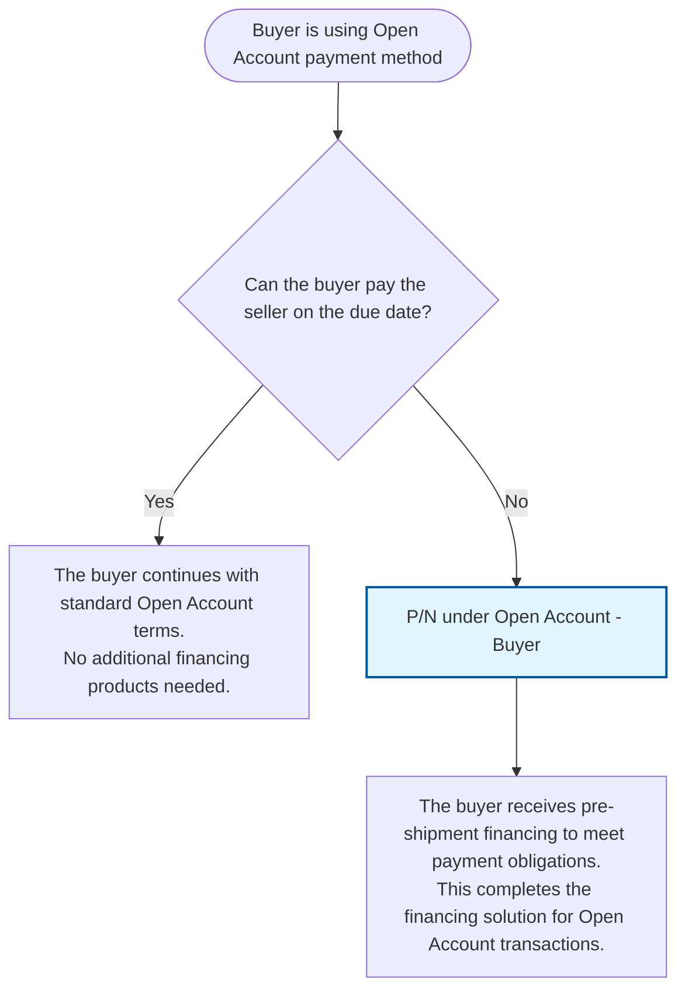

# Buyer Open Account Decision Diagram

## Decision Flow for Buyers Using Open Account Payment Method

## Product Details

### P/N under Open Account - Buyer

- **Type**: Pre-shipment financing for buyers
- **Purpose**: Provides financing when the buyer cannot pay the seller on the due date
- **Application**: Used in Open Account payment arrangements where buyers need working capital support

## Key Decision Point

**Primary Question**: "Can the buyer pay the seller on the due date?"

- This is the critical decision point that determines whether additional financing is needed
- Based on the buyer's cash flow and payment capability assessment
