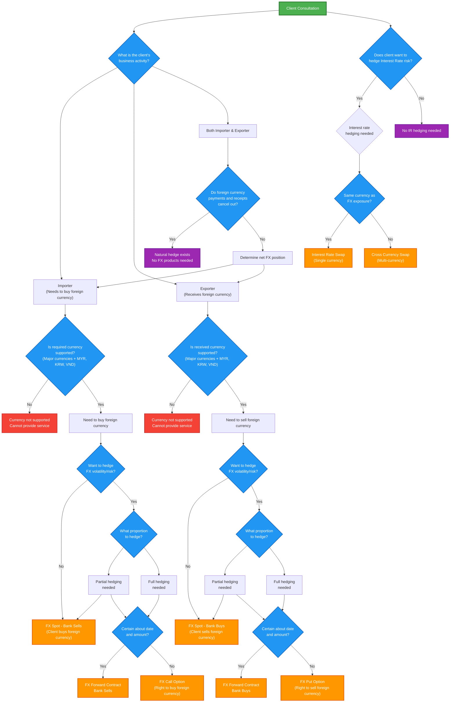

# Global Markets Product Recommendation Decision DAG

## Overview
This decision DAG helps determine the appropriate Global Markets products for clients based on their business activities and risk management needs.

## Key Features
- **Multiple paths possible**: Clients can take both hedged and unhedged positions (partial hedging)
- **Natural hedge detection**: Identifies when importers/exporters may not need FX products
- **Currency support validation**: Only major currencies + MYR, KRW, VND are supported
- **Integrated IR hedging**: Includes Interest Rate Swap and Cross Currency Swap decisions

## Mermaid DAG

## Product Mapping

### FX Products
- **FX Spot - Bank Buys**: Client sells foreign currency to bank
- **FX Spot - Bank Sells**: Client buys foreign currency from bank
- **FX Forward Contract - Bank Buys**: Bank agrees to buy foreign currency at future date
- **FX Forward Contract - Bank Sells**: Bank agrees to sell foreign currency at future date
- **FX Call Option**: Right (not obligation) to buy foreign currency
- **FX Put Option**: Right (not obligation) to sell foreign currency

### Interest Rate Products
- **Interest Rate Swap (IRS)**: Exchange fixed/floating rates in same currency
- **Cross Currency Swap (CCS)**: Exchange payments in different currencies

## Key Decision Points

1. **Client Type**: Importer, Exporter, or Both
2. **Natural Hedge**: For clients who are both importers and exporters
3. **Currency Support**: Only major currencies + MYR, KRW, VND supported
4. **Hedge Preference**: Whether client wants to hedge FX risk
5. **Hedge Proportion**: Full vs partial hedging (DAG allows both paths)
6. **Certainty**: Date and amount certainty determines Forward vs Option
7. **Interest Rate Risk**: Separate decision path for IR hedging 