# LC Products Decision Diagram - Buyer Pre-shipment (With Extra Products)

```mermaid
flowchart TD
    Start@{ label: "<span style=\"color:\">LC Buyer Decision Diagram</span>" } --> LC1["Letter of Credit Issuance"]
    LC1 --> BL_Check@{ label: "Has original B/L arrived at buyer's bank?" }
    BL_Check -- No --> Want_Goods{"Does buyer want to claim goods immediately?"}
    BL_Check -- Yes --> LC_Type{"Using Sight LC or Usance LC?"}
    Want_Goods -- Yes --> SG1["Shipping Guarantee Issuance"]
    Want_Goods -- No --> Wait@{ label: "Wait for original B/L to arrive at the buyer's bank" }
    Wait --> LC_Type
    SG1 --> SG_Flow["Buyer claims goods immediately using shipping guarantee"]
    SG_Flow --> BL_Arrive@{ label: "Wait for original B/L to arrive at the buyer's bank" }
    BL_Arrive --> LC_Type
    LC_Type -- Sight LC --> Calc_Sight["Calculate financing gap using Sight LC formula"]
    LC_Type -- Usance LC --> Calc_Usance["Calculate financing gap using Usance LC formula"]
    Calc_Sight --> Need_Finance{"Does buyer need financing based on gap calculation?"}
    Calc_Usance --> BA_Check{"Does seller need stronger payment security OR concerned about waiting 90 days?"}
    BA_Check -- Yes --> BA1["Bankers Acceptance"]
    BA_Check -- No --> Need_Finance
    BA1 --> Need_Finance
    Need_Finance -- No --> No_Finance_End["Wait for LC payment at maturity - no additional products needed"]
    Need_Finance -- Yes --> BL_Name{"Who has title to the goods on the B/L?"}
    BL_Name -- The buyer --> PN1["P/N under Letter of Credit"]
    BL_Name -- The bank --> TR1["Trust Receipt Loan under Letter of Credit"]
    PN1 --> SG_Check1{"Was Shipping Guarantee Issuance used?"}
    TR1 --> Endorse1["Endorsement Services"]
    Endorse1 --> SG_Check2{"Was Shipping Guarantee Issuance used?"}
    SG_Check1 -- Yes --> Exchange1["Exchange B/L for shipping guarantee to complete the flow"]
    SG_Check1 -- No --> PN_Complete["P/N financing completed - buyer can proceed with trade"]
    SG_Check2 -- Yes --> Exchange2["Exchange B/L for shipping guarantee to complete the flow"]
    SG_Check2 -- No --> TR_Complete["Trust receipt and endorsement completed - buyer can proceed with trade"]

    Start@{ shape: stadium}
    BL_Check@{ shape: diamond}
    Wait@{ shape: rect}
    BL_Arrive@{ shape: rect}
     LC1:::productBox
     SG1:::productBox
     BA_Check:::newDecisionBox
     BA1:::newProductBox
     PN1:::productBox
     TR1:::productBox
     Endorse1:::productBox
    classDef productBox fill:#e1f5fe,stroke:#01579b,stroke-width:2px
    classDef newProductBox fill:#ffebee,stroke:#c62828,stroke-width:2px,color:#c62828
    classDef newDecisionBox fill:#fce4ec,stroke:#d81b60,stroke-width:2px,color:#d81b60
```

## Decision Points Summary

1. **Start**: Buyer is already using LC payment method (mandatory Letter of Credit Issuance)
2. **B/L Arrival**: Check if original B/L has arrived at buyer's bank
3. **Immediate Goods**: If no B/L, does buyer want to claim goods immediately?
4. **LC Type**: Determine if using Sight LC or Usance LC
5. **Bankers Acceptance Check**: For Usance LC, assess if seller needs stronger payment security, guaranteed payment certainty, or is concerned about waiting 90 days for payment
6. **Financing Need**: Calculate financing gap and determine if financing is needed
7. **B/L Issuer**: Check if B/L is issued under buyer's name or buyer's bank's name
8. **Shipping Guarantee**: Check if Shipping Guarantee Issuance was used to determine final steps

## Product Flow Conclusions

- **No Financing Path**: Wait for payment completion - no additional products needed
- **Bankers Acceptance Path**: BA provides bank guarantee (safer than buyer's promise), gives seller guaranteed payment certainty after documents are accepted, allows seller to choose between discounting for immediate cash or waiting for guaranteed maturity payment
- **P/N Path**: P/N financing completed - buyer can proceed with trade (with potential B/L exchange if shipping guarantee used)
- **Trust Receipt Path**: Trust receipt and endorsement completed - buyer can proceed with trade (with potential B/L exchange if shipping guarantee used)
- **Shipping Guarantee Path**: All paths that used shipping guarantee require exchanging B/L for the shipping guarantee to complete the flow

## New Products Added

### Bankers Acceptance (BA)

- **Product Type**: A financing for Buyers (benefits both buyer and seller)
- **When Available**: Only with Usance LC payment terms
- **How It Works**:
  - Buyer triggers the product but seller drives the decision based on their needs
  - Seller gets bank guarantee (safer than buyer's promise)
  - Buyer reimburses their bank at maturity
- **Seller Benefits**:
  - Stronger payment security than just LC issuing bank
  - Guaranteed payment certainty after documents are accepted
  - Flexibility to discount BA for immediate cash (don't wait 90 days)
  - If no immediate cash needed, still has bank-guaranteed maturity payment
- **Use When Seller**:
  - Wants stronger payment security than LC issuing bank provides
  - Needs guaranteed payment certainty after document acceptance
  - Is concerned about waiting 90 days for payment from buyer
- **Decision Point**: Assess if seller has any of the above concerns or needs
