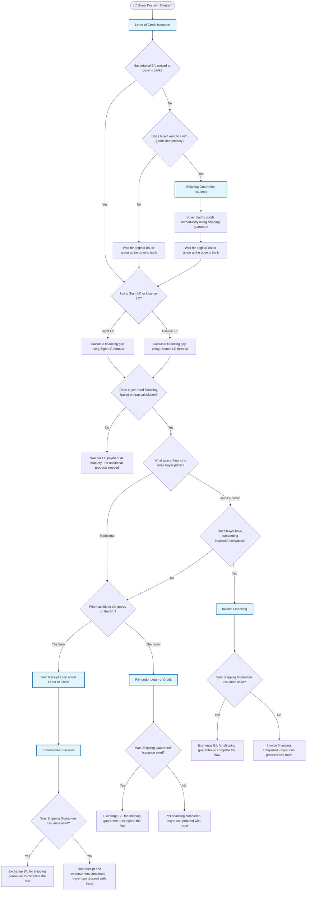

# LC Products Decision Diagram - Buyer Pre-shipment

## Decision Points Summary

1. **Start**: Buyer is already using LC payment method (mandatory Letter of Credit Issuance)
2. **B/L Arrival**: Check if original B/L has arrived at buyer's bank
3. **Immediate Goods**: If no B/L, does buyer want to claim goods immediately?
4. **LC Type**: Determine if using Sight LC or Usance LC
5. **Financing Need**: Calculate financing gap and determine if financing is needed
6. **Financing Type**: Choose between traditional financing (based on goods/B/L) or invoice-based financing
7. **Invoice Availability**: For invoice-based financing, check if buyer has outstanding invoices/receivables
8. **B/L Issuer**: For traditional financing, check if B/L is issued under buyer's name or buyer's bank's name
9. **Shipping Guarantee**: Check if Shipping Guarantee Issuance was used to determine final steps

## Product Flow Conclusions

- **No Financing Path**: Wait for payment completion - no additional products needed
- **P/N Path**: P/N financing completed - buyer can proceed with trade (with potential B/L exchange if shipping guarantee used)
- **Trust Receipt Path**: Trust receipt and endorsement completed - buyer can proceed with trade (with potential B/L exchange if shipping guarantee used)
- **Invoice Financing Path**: Invoice financing completed - buyer can proceed with trade (with potential B/L exchange if shipping guarantee used)
- **Shipping Guarantee Path**: All paths that used shipping guarantee require exchanging B/L for the shipping guarantee to complete the flow

## Invoice Financing Decision Points

**When to offer Invoice Financing:**

- Buyer needs financing but prefers to use their outstanding invoices/receivables as collateral
- Buyer has strong receivables portfolio that can support financing needs
- Buyer wants to solve cash flow issues through invoice-based mechanisms rather than traditional goods-based financing
- Applicable for buyers who have diversified business operations with substantial accounts receivable

**Invoice Financing Benefits:**

- Solves cash flow issues for buyers by leveraging their existing receivables
- Provides alternative financing mechanism not dependent on goods title or B/L ownership
- Can be faster to process as it's based on existing invoices rather than waiting for goods documentation
- Suitable for buyers with strong customer payment history and diversified receivables portfolio
