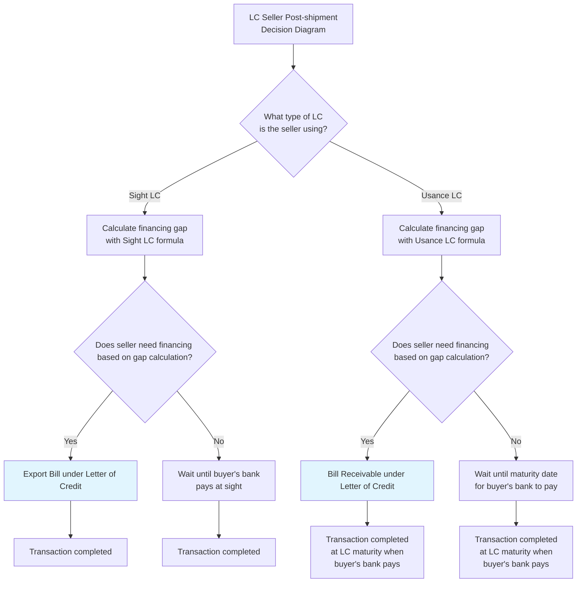

## Decision Flow

```mermaid
flowchart TD
    A@{ label: "<span style=\"color:\">LC Seller Post-shipment</span><br style=\"--tw-scale-x:\"><span style=\"color:\">Decision Diagram</span>" } --> B{"What type of LC<br>is the seller using?"}
    B -- Sight LC --> C["Calculate financing gap<br>with Sight LC formula"]
    B -- Usance LC --> D["Calculate financing gap<br>with Usance LC formula"]
    C --> E{"Does seller need financing based on gap calculation?"}
    D --> F{"Does seller need financing based on gap calculation?"}
    E -- Yes --> G["Export Bill under Letter of Credit"]
    E -- No --> H@{ label: "Wait until buyer's bank<br>pays at sight" }
    F -- Yes --> I["Bill Receivable under Letter of Credit"]
    F -- No --> J@{ label: "Wait until maturity date<br>for buyer's bank to pay" }
    G --> K["Transaction completed"]
    H --> L["Transaction completed"]
    I --> M@{ label: "Transaction completed<br>at LC maturity when<br>buyer's bank pays" }
    J --> N@{ label: "Transaction completed<br>at LC maturity when<br>buyer's bank pays" }

    A@{ shape: rect}
    H@{ shape: rect}
    J@{ shape: rect}
    M@{ shape: rect}
    N@{ shape: rect}
    style G fill:#e1f5fe
    style I fill:#e1f5fe
```
