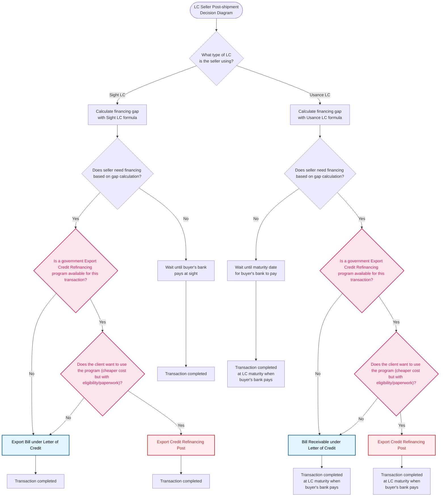

# Letter of Credit Products - Seller Post-shipment Decision Tree (With Extra Products)

## Decision Points Summary

1. **Start**: Seller is using LC payment method and has shipped goods (post-shipment timing)
2. **LC Type Check**: Determine if seller is using Sight LC or Usance LC
3. **Financing Gap Calculation**: Calculate financing needs using appropriate LC formula
4. **Financing Need Check**: Determine if seller needs financing based on gap calculation
5. **ECR Program Availability**: Check if a government Export Credit Refinancing program is available for this transaction
6. **ECR Program Usage**: If available, determine if client wants to use the program (cheaper cost but with eligibility/paperwork requirements)

## Product Flow Conclusions

- **Sight LC with ECR**: Government-subsidized financing with cheaper rates for immediate payment needs
- **Usance LC with ECR**: Government-subsidized financing with cheaper rates for deferred payment structures
- **Standard Export Bill Path**: Traditional immediate financing under Sight LC
- **Standard Bill Receivable Path**: Traditional financing for Usance LC with immediate cash flow
- **No Financing Path**: Wait for natural payment timing based on LC terms

## New Product Added

### Export Credit Refinancing Post

- **Product Type**: A government-subsidized financing for exporters (Post-shipment timing)
- **How It Works**:
  - Central bank/export agency provides cheap funds to commercial banks
  - Commercial banks pass on cheaper rates to exporters
  - Financing provided after goods are shipped and documents are submitted
  - "Government helps banks so banks help exporters"
- **Use When**:
  - Government export credit program is available
  - Seller wants to expand exports but concerned about financing costs
  - Seller wants to reduce post-shipment financing costs
  - Documents have been submitted and seller needs immediate cash flow
- **Benefits**:
  - Cheaper credit for exporters compared to standard rates
  - Government backing reduces financing costs
  - Supports export expansion and competitiveness
  - Available for both Sight and Usance LC structures
- **Decision Points**:
  - Step 1: Check if government Export Credit Refinancing program is available for the transaction
  - Step 2: If available, check if client wants to use the program despite eligibility and paperwork requirements
