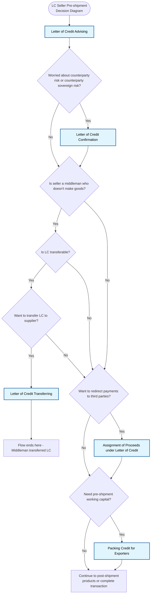

# Letter of Credit Products - Seller Pre-shipment Decision Tree

```mermaid
flowchart TD
    Start@{ label: "<span style=\"color:\">LC Seller Pre-shipment</span><br style=\"--tw-scale-x:\"><span style=\"color:\">Decision Diagram</span>" } --> LCAdvising["Letter of Credit Advising"]
    LCAdvising --> RiskConcern{"Worried about counterparty risk or counterparty sovereign risk?"}
    RiskConcern -- Yes --> LCConfirm["Letter of Credit Confirmation"]
    RiskConcern -- No --> CheckMiddleman@{ label: "Is seller a middleman who doesn't make goods?" }
    LCConfirm --> CheckMiddleman
    CheckMiddleman -- Yes --> TransferableCheck{"Is LC transferable?"}
    TransferableCheck -- Yes --> WantTransfer{"Want to transfer LC to supplier?"}
    WantTransfer -- Yes --> LCTransfer["Letter of Credit Transferring"]
    WantTransfer -- No --> CheckAssign{"Want to redirect payments to third parties?"}
    TransferableCheck -- No --> CheckAssign
    LCTransfer --> End1["Flow ends here - Middleman transferred LC"]
    CheckMiddleman -- No --> CheckAssign
    CheckAssign -- Yes --> AssignProceeds["Assignment of Proceeds under Letter of Credit"]
    CheckAssign -- No --> CheckPacking{"Need pre-shipment working capital?"}
    AssignProceeds --> CheckPacking
    CheckPacking -- Yes --> PackingCredit["Packing Credit for Exporters"]
    CheckPacking -- No --> ContinueFlow@{ label: "Continue to post-shipment<br style=\"--tw-scale-x:\">products or complete transaction" }
    PackingCredit --> ContinueFlow

    Start@{ shape: stadium}
    CheckMiddleman@{ shape: diamond}
    ContinueFlow@{ shape: rect}
     LCAdvising:::productBox
     LCConfirm:::productBox
     LCTransfer:::productBox
     AssignProceeds:::productBox
     PackingCredit:::productBox
    classDef productBox fill:#e1f5fe,stroke:#01579b,stroke-width:2px,color:#000
```
