# Letter of Credit Products - Seller Pre-shipment Decision Tree (With Extra Products)

```mermaid
flowchart TD
    Start@{ label: "<span style=\"color:\">LC Seller Pre-shipment</span><br style=\"--tw-scale-x:\"><span style=\"color:\">Decision Diagram</span>" } --> LCAdvising["Letter of Credit Advising"]
    LCAdvising --> RiskConcern{"Worried about counterparty risk or counterparty sovereign risk?"}
    RiskConcern -- Yes --> LCConfirm["Letter of Credit Confirmation"]
    RiskConcern -- No --> CheckMiddleman@{ label: "Is seller a middleman who doesn't make goods?" }
    LCConfirm --> CheckMiddleman
    CheckMiddleman -- Yes, is a middleman --> TransferableCheck{"Is LC transferable?"}
    TransferableCheck -- Yes --> WantTransfer{"Want to transfer LC to supplier?"}
    WantTransfer -- Yes --> LCTransfer["Letter of Credit Transferring"]
    WantTransfer -- No --> BackToBackCheck{"Does the seller need more control OR different LC terms (amounts, dates, documents)?"}
    TransferableCheck -- No --> BackToBackCheck
    LCTransfer --> End1["Flow ends here - Middleman transferred LC"]
    CheckMiddleman -- No, produce own goods --> CheckAssign{"Want to redirect payments to third parties?"}
    BackToBackCheck -- Yes --> BackToBackLC["Back-to-Back LC"]
    BackToBackCheck -- No --> CheckAssign
    BackToBackLC --> CheckAssign
    CheckAssign -- Yes --> AssignProceeds["Assignment of Proceeds under Letter of Credit"]
    CheckAssign -- No --> CheckPacking{"Need pre-shipment working capital?"}
    AssignProceeds --> CheckPacking
    CheckPacking -- Yes --> ECRAvailable{"Is a government Export Credit Refinancing program available for this transaction?"}
    CheckPacking -- No --> ContinueFlow@{ label: "Continue to post-shipment<br style=\"--tw-scale-x:\">products or complete transaction" }
    ECRAvailable -- No --> PackingCredit["Packing Credit for Exporters"]
    ECRAvailable -- Yes --> ECRWant{"Does the client want to use the program (cheaper cost but with eligibility/paperwork)?"}
    ECRWant -- Yes --> ECR["Export Credit Refinancing Pre Ship"]
    ECRWant -- No --> PackingCredit
    ECR --> ContinueFlow
    PackingCredit --> ContinueFlow

    Start@{ shape: stadium}
    CheckMiddleman@{ shape: diamond}
    ContinueFlow@{ shape: rect}
     LCAdvising:::productBox
     LCConfirm:::productBox
     LCTransfer:::productBox
     BackToBackCheck:::newDecisionBox
     BackToBackLC:::newProductBox
     AssignProceeds:::productBox
     ECRAvailable:::newDecisionBox
     PackingCredit:::productBox
     ECRWant:::newDecisionBox
     ECR:::newProductBox
    classDef productBox fill:#e1f5fe,stroke:#01579b,stroke-width:2px,color:#000
    classDef newProductBox fill:#ffebee,stroke:#c62828,stroke-width:2px,color:#c62828
    classDef newDecisionBox fill:#fce4ec,stroke:#d81b60,stroke-width:2px,color:#d81b60
```

## Decision Points Summary

1. **Start**: Seller is using LC payment method (mandatory Letter of Credit Advising)
2. **Risk Concern**: Check if seller is worried about counterparty risk or sovereign risk
3. **Middleman Check**: Determine if seller is a middleman who doesn't manufacture goods
4. **Transferable Check**: For middlemen, check if the LC is transferable
5. **Transfer Intent**: If transferable, check if seller wants to transfer LC to supplier
6. **Back-to-Back LC Check**: If not transferring or LC not transferable, assess if seller needs more control or different LC terms
7. **Assignment Check**: Check if seller wants to redirect payments to third parties
8. **Working Capital Check**: Determine if seller needs pre-shipment working capital
9. **ECR Program Availability**: For working capital needs, check if a government Export Credit Refinancing program is available for this transaction
10. **ECR Program Usage**: If available, determine if client wants to use the program (cheaper cost but with eligibility/paperwork requirements)

## Product Flow Conclusions

- **LC Transfer Path**: Middleman transfers LC to supplier - flow ends
- **Back-to-Back LC Path**: Seller gets bank to issue new LC to supplier using original LC as security, provides more control and flexibility
- **ECR Path**: Government-subsidized financing with cheaper rates for export expansion
- **Standard Packing Credit Path**: Traditional pre-shipment working capital financing
- **Assignment Path**: Payments redirected to specified third parties
- **No Working Capital Path**: Continue to post-shipment products or complete transaction

## New Products Added

### Back-to-Back LC

- **Product Type**: A financing/guarantee for Sellers who act as middlemen (Pre-shipment timing)
- **How It Works**:
  - Seller uses the original LC agreed with buyer as security
  - Bank issues another LC to the supplier on behalf of the seller
- **Use When**:
  - Original LC is NOT transferable
  - Seller needs more control over the transaction
  - LC terms need to be different (amounts, dates, documents)
- **Benefits**:
  - Provides flexibility when LC Transfer is not suitable
  - Allows middleman to maintain control over supplier relationship
  - Enables customization of terms for supplier LC

### Export Credit Refinancing Pre Ship

- **Product Type**: A government-subsidized financing for sellers/exporters to produce goods before shipping (Pre-shipment)
- **How It Works**:
  - Central bank provides low interest rate loans to companies that export "local content" via local banks
  - Commercial banks pass on cheaper rates to sellers/exporters
  - Financing is backed by export orders
  - "Government helps banks so banks help sellers/exporters"
- **Use When**:
  - Government export credit program is available
  - Seller wants to expand exports but concerned about financing costs
  - Seller wants to reduce interest rates to make export deal viable
  - Need financing to produce goods before shipping
- **Benefits**:
  - Cheaper credit for sellers/exporters compared to standard rates
  - Government backing reduces financing costs
  - Supports export expansion and competitiveness
  - Local government policy/scheme to encourage/grow local companies to export
- **Decision Points**:
  - Step 1: Check if government Export Credit Refinancing program is available for the transaction
  - Step 2: If available, check if client wants to use the program despite eligibility and paperwork requirements
