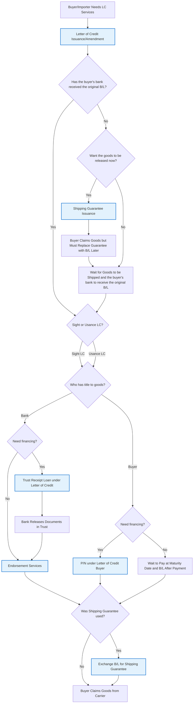

# Letter of Credit Products - Buyer/Importer Decision Diagram

## Overview

This decision diagram covers all LC-related products offered by the bank specifically for buyers/importers. It starts with core LC issuance services and then branches based on shipment status, document availability, title ownership, and financing requirements.

## Decision Flow

## Product Categories

### Core Service

- **Letter of Credit Issuance/Amendment** - Base LC product for buyers/importers

### Post-Shipment Services & Financing

- **Trust Receipt Loan under Letter of Credit** - Buyer financing when bank has title to goods via B/L
- **P/N under Letter of Credit Buyer** - Buyer financing when buyer has title to goods via B/L
- **Shipping Guarantee Issuance** - Service when buyer needs goods released before bank receives original B/L
- **Endorsement Services** - Service to transfer ownership from bank to buyer (when bank had title)
- **Exchange B/L for Shipping Guarantee** - Service to replace temporary shipping guarantee with original B/L

## Decision Logic

### Primary Decision Points:

1. **Document Status** - Whether the buyer's bank has received the original B/L
2. **Immediate Release** - Whether buyer wants goods released before B/L arrival (Shipping Guarantee)
3. **Payment Terms** - Whether LC is Sight or Usance (when B/L received)
4. **Title Ownership** - Whether bank or buyer has title to goods via Bill of Lading
5. **Financing Needs** - Whether buyer needs working capital to handle goods
6. **Shipping Guarantee Settlement** - Whether to exchange B/L for previously issued Shipping Guarantee

### Key Considerations:

- **LC Issuance/Amendment** is the prerequisite core service for all buyers
- **Early Shipping Guarantee** option available when bank hasn't received B/L but buyer needs goods released immediately
- **Title ownership** (via B/L) determines the type of financing available:
  - Bank has title → Trust Receipt Loan → Endorsement Services
  - Buyer has title → P/N under Letter of Credit Buyer
- **Early document timing** creates the option for Shipping Guarantee when buyer needs goods released before bank receives original B/L
- **Shipping Guarantee closure** is required when guarantee was used - B/L must be exchanged to close the bank's liability
- **Financing decisions** are made after establishing title ownership

### Flow Logic:

The decision tree follows the natural sequence of international trade:

1. LC is issued for the transaction
2. Check if bank has received original B/L
   - If No: Decide whether to release goods immediately (Shipping Guarantee) or wait for B/L
3. If B/L received: Determine payment terms (Sight or Usance LC)
4. Determine who has title to the goods
5. Provide appropriate services and financing based on title ownership:
   - Bank has title → Financing decision → Trust Receipt or Endorsement → Was Shipping Guarantee used? → Exchange if needed → Claim goods
   - Buyer has title → Financing decision → P/N or Wait for Maturity → Was Shipping Guarantee used? → Exchange if needed → Claim goods

This ensures buyers receive services that match their exact position in the trade cycle and cash flow requirements.
