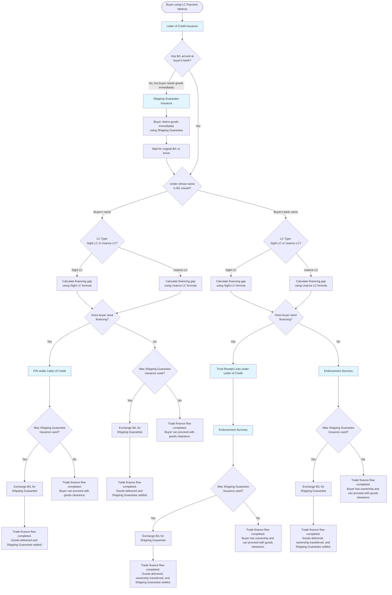

# Letter of Credit Products Decision Diagram - Buyer Pre-shipment

This decision diagram shows the flow for buyers in pre-shipment stage when using Letter of Credit payment method.

## Decision Flow

## Products Covered

### Mandatory Products

- **Letter of Credit Issuance**: Base LC product mandatory when buyer and seller agree to use LC payment method

### Optional Products Based on Situation

- **Shipping Guarantee Issuance**: When buyer's bank hasn't received original B/L but buyer needs goods immediately
- **P/N under Letter of Credit (Buyer)**: Financing when B/L is at buyer's bank and issued under buyer's name
- **Trust Receipt Loan under Letter of Credit**: Financing when B/L is at buyer's bank and issued under buyer's bank's name
- **Endorsement Services**: Required when B/L is issued under buyer's bank's name to transfer ownership to buyer

## Key Decision Points

1. **B/L Receipt**: Whether buyer's bank has received the original Bill of Lading
2. **B/L Ownership**: Under whose name the B/L is issued (buyer vs buyer's bank)
3. **LC Type**: Whether using Sight LC or Usance LC for financing calculations
4. **Financing Need**: Based on financing gap calculation results
5. **Shipping Guarantee Usage**: Whether Shipping Guarantee Issuance was used earlier in the flow

## Flow Conclusions

The diagram shows multiple ending scenarios:

- **Simple completion**: When no additional financing or services are needed
- **Exchange completion**: When Shipping Guarantee was used and needs to be exchanged with B/L
- All flows conclude with either completing the trade finance process or proceeding with trade settlement
