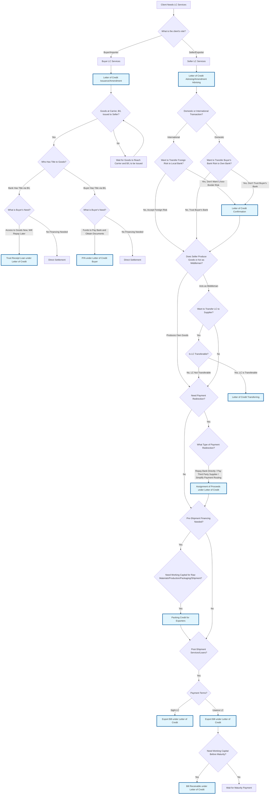

# Letter of Credit Products - Comprehensive Decision Diagram

## Overview

This decision diagram covers all LC-related products offered by the bank, organized by decision order and complexity. Core LC services (issuance for buyers, advising for sellers) are automatic prerequisites. The diagram then branches based on specific business needs and timing requirements.

## Decision Flow

## Product Categories

### Buyer Products

#### Core Service

- **Letter of Credit Issuance/Amendment** - Base LC product for buyers

#### Post-Shipment Financing

- **Trust Receipt Loan under Letter of Credit** - Buyer financing when bank has title to goods
- **P/N under Letter of Credit Buyer** - Buyer financing when buyer has title to goods

### Seller Products

#### Core Service

- **Letter of Credit Advising/Amendment Advising** - Base LC product for sellers
- **Export Bill under Letter of Credit** - Core post-shipment document service (ALL sellers need this)

#### Pre-Shipment Services

- **Letter of Credit Confirmation** - Transfer foreign/cross-border risk to local bank
- **Assignment of Proceeds under Letter of Credit** - Payment redirection only (seller remains responsible for LC terms)
- **Letter of Credit Transferring** - Middleman trading solution (transfers LC obligations)
- **Packing Credit for Exporters** - Pre-shipment working capital

#### Post-Shipment Financing

- **Bill Receivable under Letter of Credit** - Seller financing for usance LCs

## Decision Logic

### Primary Decision Points:

- **Client Role** - Buyer, Seller, or Trading Company
- **Core LC Need** - Whether basic LC services are required
- **Timing** - Pre-shipment vs. post-shipment needs
- **Risk Profile** - Need for additional guarantees
- **Cash Flow** - Financing requirements and timing
- **Goods Ownership** - Who controls the goods at arrival

### Key Considerations:

- **Core products** are prerequisites for other services
- **Pre-shipment services** focus on risk mitigation and working capital
- **Post-shipment financing** addresses cash flow gaps after shipment
- **Transferable LC** serves a specific middleman business model
- **Assignment of Proceeds** is a payment routing service, not financing

This decision tree ensures clients receive the appropriate combination of LC services based on their role, timing needs, and risk tolerance.
