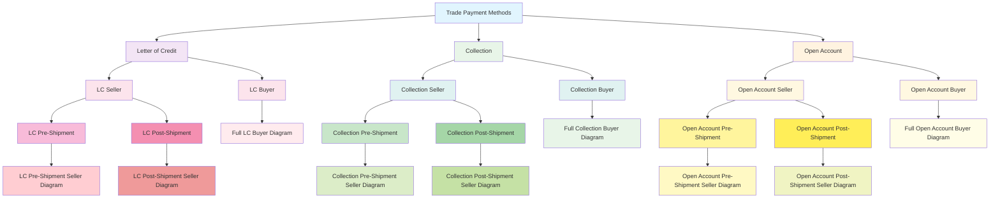

```mermaid
graph TD
A["Trade Payment Methods"] --> B["Letter of Credit"]
A --> C["Collection"]
A --> D["Open Account"]

    B --> E["LC Seller"]
    B --> F["LC Buyer"]

    C --> G["Collection Seller"]
    C --> H["Collection Buyer"]

    D --> I["Open Account Seller"]
    D --> J["Open Account Buyer"]

    E --> E1["LC Pre-Shipment"]
    E --> E2["LC Post-Shipment"]

    G --> G1["Collection Pre-Shipment"]
    G --> G2["Collection Post-Shipment"]

    I --> I1["Open Account Pre-Shipment"]
    I --> I2["Open Account Post-Shipment"]

    F --> L["Full LC Buyer Diagram"]
    H --> N["Full Collection Buyer Diagram"]
    J --> P["Full Open Account Buyer Diagram"]

    E1 --> K1["LC Pre-Shipment Seller Diagram"]
    E2 --> K2["LC Post-Shipment Seller Diagram"]
    G1 --> M1["Collection Pre-Shipment Seller Diagram"]
    G2 --> M2["Collection Post-Shipment Seller Diagram"]
    I1 --> O1["Open Account Pre-Shipment Seller Diagram"]
    I2 --> O2["Open Account Post-Shipment Seller Diagram"]

    style A fill:#e1f5fe
    style B fill:#f3e5f5
    style C fill:#e8f5e8
    style D fill:#fff3e0
    style E fill:#fce4ec
    style F fill:#fce4ec
    style G fill:#e0f2f1
    style H fill:#e0f2f1
    style I fill:#fff8e1
    style J fill:#fff8e1
    style E1 fill:#f8bbd9
    style E2 fill:#f48fb1
    style G1 fill:#c8e6c9
    style G2 fill:#a5d6a7
    style I1 fill:#fff59d
    style I2 fill:#ffee58
    style L fill:#ffebee
    style N fill:#e8f5e8
    style P fill:#fffde7
    style K1 fill:#ffcdd2
    style K2 fill:#ef9a9a
    style M1 fill:#dcedc8
    style M2 fill:#c5e1a5
    style O1 fill:#fff9c4
    style O2 fill:#f0f4c3
```
