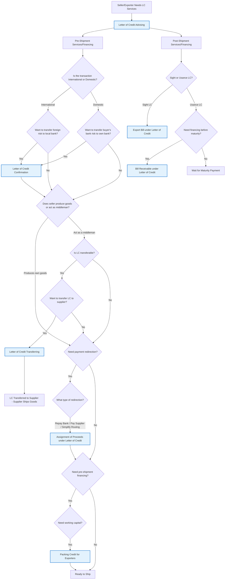

# Letter of Credit Products - Seller/Exporter Decision Diagram

## Overview

This decision diagram covers all LC-related products offered by the bank specifically for sellers/exporters. It starts with core LC advising services and then branches based on timing requirements (pre-shipment vs post-shipment) and specific business needs.

## Decision Flow

## Product Categories

### Core Service

- **Letter of Credit Advising** - Base LC product for sellers
- **Export Bill under Letter of Credit** - Core post-shipment document service (ALL sellers need this)

### Risk Mitigation Services

- **Letter of Credit Confirmation** - Transfer foreign/cross-border risk to local bank

### Pre-Shipment Services

- **Assignment of Proceeds under Letter of Credit** - Payment redirection only (seller remains responsible for LC terms)
- **Letter of Credit Transferring** - Middleman trading solution (transfers LC obligations)
- **Packing Credit for Exporters** - Pre-shipment working capital

### Post-Shipment Financing

- **Bill Receivable under Letter of Credit** - Seller financing for usance LCs

## Decision Logic

### Primary Decision Points:

1. **Transaction Type** - Domestic vs International (determines risk profile)
2. **Risk Appetite** - Whether to transfer bank/country risk
3. **Timing** - Pre-shipment vs post-shipment needs (key decision point)
4. **Business Model** - Producer vs middleman/trader
5. **Payment Structure** - Payment redirection needs
6. **Financing Needs** - Working capital requirements
7. **Payment Terms** - Sight vs usance LC terms

### Key Considerations:

- **Core products** (Advising and Export Bill) are prerequisites for other services
- **Pre-shipment services** focus on risk mitigation, payment routing, and working capital
- **Post-shipment financing** addresses cash flow gaps after shipment
- **Transferable LC** serves a specific middleman business model
- **Assignment of Proceeds** is a payment routing service, not financing
- **All exporters** will eventually need Export Bill services regardless of other choices

## Flow Logic

The diagram starts with mandatory LC advising services, then branches based on risk appetite and confirmation needs. The key innovation is the clear **Pre-Shipment vs Post-Shipment** decision point that helps structure the conversation and product recommendations based on the client's current business stage and immediate needs.

This separation ensures that relationship managers can:

- Focus discussions on relevant timing-based needs
- Clearly identify whether the client is in planning/production phase (pre-shipment) or has already shipped goods (post-shipment)
- Provide appropriate product recommendations based on the client's current business cycle stage
