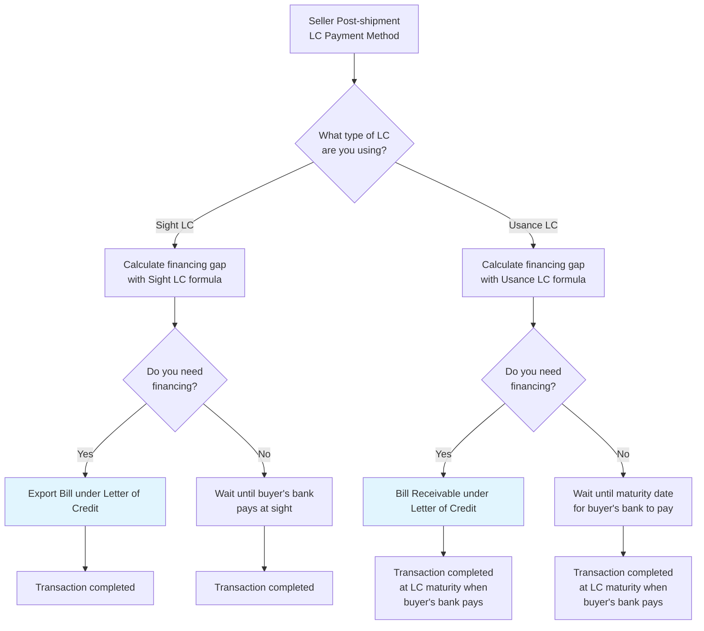

## Decision Flow

```mermaid
flowchart TD
    A[Seller Post-shipment<br/>LC Payment Method] --> B{What type of LC<br/>are you using?}

    B -->|Sight LC| C[Calculate financing gap<br/>with Sight LC formula]
    B -->|Usance LC| D[Calculate financing gap<br/>with Usance LC formula]

    C --> E{Do you need<br/>financing?}
    D --> F{Do you need<br/>financing?}

    E -->|Yes| G[Export Bill under Letter of Credit]
    E -->|No| H[Wait until buyer's bank<br/>pays at sight]

    F -->|Yes| I[Bill Receivable under Letter of Credit]
    F -->|No| J[Wait until maturity date<br/>for buyer's bank to pay]

    G --> K[Transaction completed]
    H --> L[Transaction completed]
    I --> M[Transaction completed<br/>at LC maturity when<br/>buyer's bank pays]
    J --> N[Transaction completed<br/>at LC maturity when<br/>buyer's bank pays]

    style G fill:#e1f5fe
    style I fill:#e1f5fe
```
