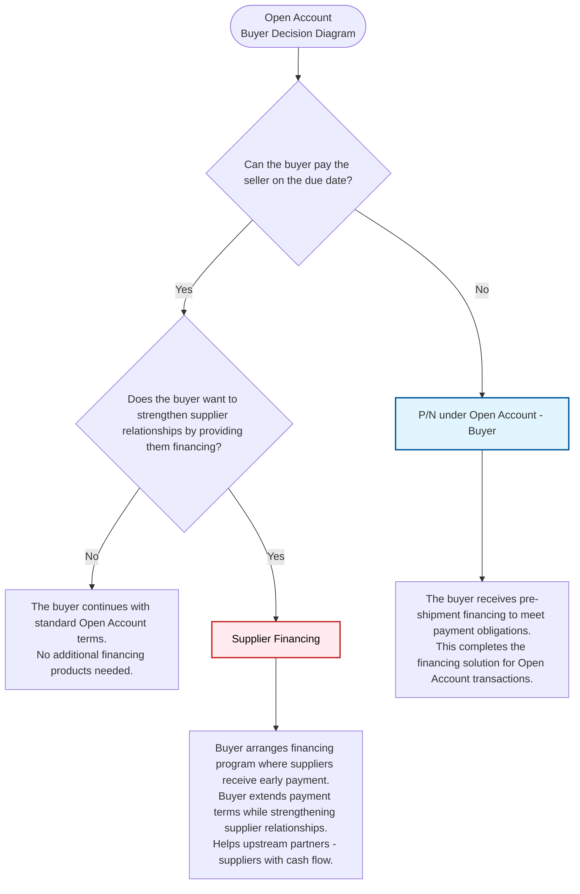

# Buyer Open Account Decision Diagram - Extended

## Decision Flow for Buyers Using Open Account Payment Method

## Product Details

### P/N under Open Account - Buyer _(Original Product)_

- **Type**: Pre-shipment financing for buyers
- **Purpose**: Provides financing when the buyer cannot pay the seller on the due date
- **Application**: Used in Open Account payment arrangements where buyers need working capital support

### Supplier Financing _(New Product)_

- **Type**: Service/financing program arranged by buyers for suppliers
- **How it Works**: Buyers arrange the program, suppliers receive the financing
- **Purpose**: Allows buyers to extend payment terms while ensuring suppliers get cash flow
- **Use Cases**:
  - When buyer wants to extend payment terms but suppliers need cash flow
  - When buyer wants to strengthen supplier relationships (buyer requests the financing)
  - When buyer has strong credit rating that suppliers lack
  - When buyer wants to improve working capital management
- **Key Questions**:
  - "How many suppliers do you work with regularly?"
  - "Would your suppliers benefit from early payment?"
- **Focus**: Help upstream partners (suppliers) while extending terms
- **Application**: Used in Open Account arrangements for supply chain financing

## Key Decision Points

**Primary Questions**:

1. "Can the buyer pay the seller on the due date?"
2. "Does the buyer want to strengthen supplier relationships by providing them financing?"

These decision points help determine the most appropriate financing solution based on:

- The buyer's immediate cash flow needs
- The buyer's strategic goals for supplier relationship management
- Whether the buyer wants to extend payment terms while supporting suppliers
