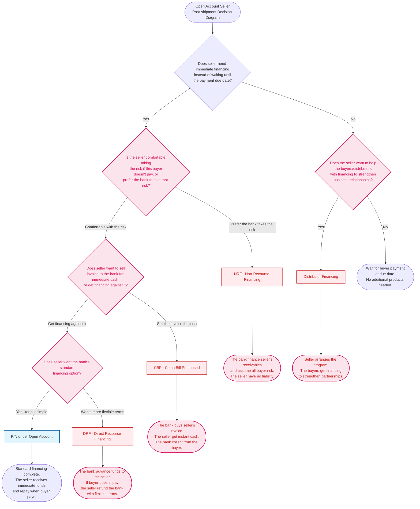

# Seller Post-Shipment Open Account Decision Diagram - Enhanced

## Decision Points Summary

### 1. Immediate Financing Need

**Question:** "Do you need immediate financing instead of waiting until the payment due date?"

**Decision Criteria:**

- **Yes**: Proceed to assess risk appetite and financing preferences
- **No**: Consider helping downstream partners or wait for payment

### 2. Risk Appetite Assessment

**Question:** "Are you comfortable taking the risk if this buyer doesn't pay, or would you prefer us to take that risk?"

**Decision Criteria:**

- **Comfortable with risk**: Explore P/N, CBP, or DRF options
- **Prefer bank takes risk**: Use NRF - Non-Recourse Financing

### 3. Transaction Structure Preference

**Question:** "Would you prefer to sell us your invoice for immediate cash, or get financing against it?"

**Decision Criteria:**

- **Sell invoice for cash**: Use CBP - Clean Bill Purchased
- **Get financing against it**: Choose between P/N or DRF

### 4. Financing Complexity Preference

**Question:** "Do you want our standard financing option?"

**Decision Criteria:**

- **Yes, keep it simple**: Use P/N under Open Account
- **Want more flexible terms**: Use DRF - Direct Recourse Financing

### 5. Downstream Partner Support

**Question:** "Would you like to help your buyers/distributors with financing to strengthen your business relationships?"

**Decision Criteria:**

- **Yes**: Use Distributor Financing
- **No**: Simply wait for payment at due date

## Product Details

### P/N under Open Account (Seller)

- **Type**: Post-shipment financing for sellers
- **Usage**: When the seller doesn't want to wait until due date, they can go to their bank for immediate financing using P/N under Open Account (Seller)
- **Outcome**: Seller receives immediate funds and the transaction flow is complete

### CBP - Clean Bill Purchased _(NEW)_

- **Type**: Post-shipment financing for sellers
- **Usage**: Seller ships goods → Creates payment bill → Bank buys bill for cash, giving the seller instant money → Bank collects from buyer later
- **Key Feature**: Seller sells their bill (IOU) to the bank for instant money
- **Risk**: Bank purchases bills without documents of title to goods attached

### DRF - Direct Recourse Financing _(NEW)_

- **Type**: Post-shipment financing for sellers
- **Usage**: Bank gives the seller money in advance, but if the buyer doesn't pay, the seller must refund the bank
- **Key Feature**: Get the money now but if the buyer doesn't pay, the risk returns to the seller
- **Risk**: Seller retains ultimate responsibility for buyer default

### NRF - Non-Recourse Financing _(NEW)_

- **Type**: Post-shipment financing for sellers
- **Usage**: Bank finances receivables and assumes the risk of buyer default (exporter has no liability)
- **Key Feature**: Bank buys your future payment and takes buyer risk
- **Best For**: "We want immediate cash from our receivables but don't want to worry about buyer default"

### Distributor Financing _(NEW)_

- **Type**: Financing program for sellers to help their buyers
- **Usage**: Sellers arrange the program, buyers receive the financing
- **Key Questions**: "Do your buyers (who buy from you for resale) need financing?"
- **Purpose**: Help downstream partners (buyers/distributors) and strengthen business relationships
