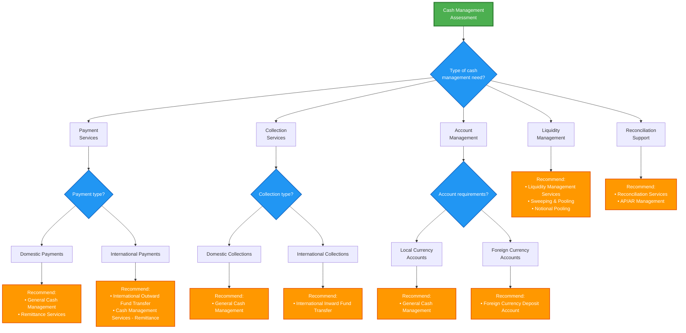
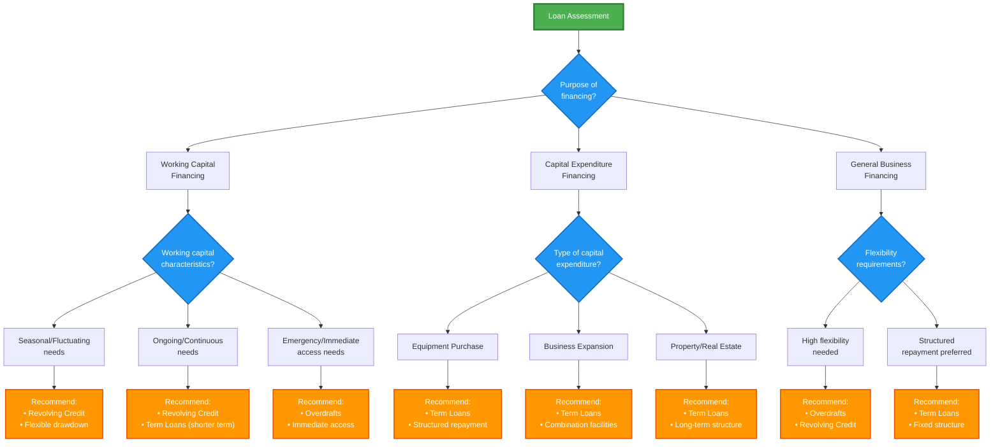
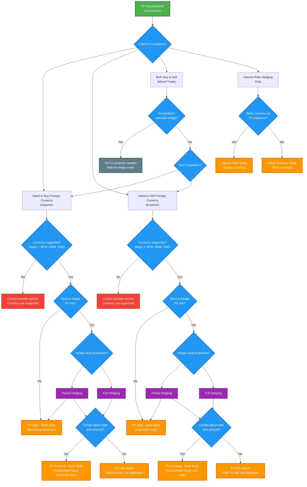

# Comprehensive Product Recommendation Decision DAG

## Overview
This decision DAG helps relationship managers determine the most appropriate banking products for clients based on their business profile, financial needs, and risk requirements. It covers all available product families: Cash Management, Global Markets, Loans, and Trade Finance.

## Key Features
- **Holistic assessment**: Considers multiple client dimensions simultaneously
- **Multi-product recommendations**: Clients often need combinations of products
- **Risk-based guidance**: Matches client risk profile with product risk levels
- **Malaysian regulatory compliance**: Aligned with local banking requirements
- **Scalable framework**: Easy to add new products as they become available

## Primary Decision DAG

```mermaid
flowchart TD
    Start["Client Assessment<br/>& Needs Analysis"] --> Profile{"What is the client's<br/>primary business profile?"}
    
    Profile --> Domestic["Domestic Business<br/>(Local operations only)"]
    Profile --> Importer["Import Business<br/>(Purchasing from overseas)"]
    Profile --> Exporter["Export Business<br/>(Selling overseas)"]
    Profile --> Mixed["Mixed Trade Business<br/>(Both import & export)"]
    Profile --> Manufacturing["Manufacturing<br/>(Production-focused)"]
    Profile --> Service["Service Business<br/>(Non-trading)"]
    
    %% Domestic Business Path
    Domestic --> DomesticNeeds{"Primary financing needs?"}
    DomesticNeeds --> WorkingCapital1["Working Capital<br/>Financing"]
    DomesticNeeds --> CapitalExp1["Capital Expenditure<br/>Financing"]
    DomesticNeeds --> CashMgmt1["Cash Flow<br/>Management"]
    
    WorkingCapital1 --> LoanAssess1{"Loan requirements?"}
    LoanAssess1 --> Overdraft1["Recommend:<br/>• Overdrafts<br/>• Revolving Credit"]
    LoanAssess1 --> ShortTerm1["Recommend:<br/>• Revolving Credit<br/>• General Cash Management"]
    
    CapitalExp1 --> TermLoan1["Recommend:<br/>• Term Loans<br/>• Fixed repayment structure"]
    
    CashMgmt1 --> CashServices1["Recommend:<br/>• General Cash Management<br/>• Liquidity Management<br/>• Reconciliation Services"]
    
    %% Import Business Path
    Importer --> ImportNeeds{"Primary import requirements?"}
    ImportNeeds --> ImportFinancing["Import Financing<br/>Needed"]
    ImportNeeds --> ImportServices["Import Services<br/>Only"]
    ImportNeeds --> ImportFX["Foreign Exchange<br/>Management"]
    
    ImportFinancing --> PaymentMethod1{"Payment method<br/>with suppliers?"}
    PaymentMethod1 --> OpenAccount1["Open Account"]
    PaymentMethod1 --> LC1["Letter of Credit"]
    PaymentMethod1 --> Collections1["Collections"]
    
    OpenAccount1 --> ImportPN_OA["Recommend:<br/>• Import P/N under Open Account<br/>• International Outward Fund Transfer"]
    LC1 --> ImportPN_LC["Recommend:<br/>• Import P/N under Letter of Credit<br/>• Trust Receipt under LC<br/>• LC Issuance/Amendment"]
    Collections1 --> ImportPN_Coll["Recommend:<br/>• Import P/N under Bill for Collection<br/>• Inward Bill for Collection"]
    
    ImportServices --> ImportServicesProd["Recommend:<br/>• LC Issuance/Amendment<br/>• Inward Bill for Collection<br/>• Shipping Guarantee Issuance"]
    
    ImportFX --> FXCurrencyCheck1{"Is required currency<br/>supported?<br/>(Major currencies + MYR, KRW, VND)"}
    FXCurrencyCheck1 -->|No| FXNotSupported1["Currency not supported<br/>Cannot provide FX service"]
    FXCurrencyCheck1 -->|Yes| ImporterFXFlow["Need to buy foreign currency<br/>(Bank Sells FX)"]
    
    ImporterFXFlow --> HedgeDecision1{"Want to hedge<br/>FX volatility/risk?"}
    HedgeDecision1 -->|No| FXSpotBuy["Recommend:<br/>• FX Spot - Bank Sells<br/>(Client buys foreign currency)"]
    HedgeDecision1 -->|Yes| HedgeProportion1{"What proportion<br/>to hedge?"}
    
    HedgeProportion1 --> PartialHedge1["Partial hedging needed"]
    HedgeProportion1 --> FullHedge1["Full hedging needed"]
    
    PartialHedge1 --> FXSpotBuy
    PartialHedge1 --> HedgeProduct1{"Certain about date<br/>and amount?"}
    FullHedge1 --> HedgeProduct1
    
    HedgeProduct1 -->|Yes| FXForwardSell["Recommend:<br/>• FX Forward Contract - Bank Sells<br/>(Guaranteed rate for future purchase)"]
    HedgeProduct1 -->|No| FXCallOption["Recommend:<br/>• FX Call Option<br/>(Right to buy foreign currency)"]
    
    %% Export Business Path
    Exporter --> ExportNeeds{"Primary export requirements?"}
    ExportNeeds --> ExportFinancing["Export Financing<br/>Needed"]
    ExportNeeds --> ExportServices["Export Services<br/>Only"]
    ExportNeeds --> ExportFX["Foreign Exchange<br/>Management"]
    
    ExportFinancing --> PaymentMethod2{"Payment method<br/>from buyers?"}
    PaymentMethod2 --> OpenAccount2["Open Account"]
    PaymentMethod2 --> LC2["Letter of Credit"]
    PaymentMethod2 --> Collections2["Collections"]
    
    OpenAccount2 --> ExportPN_OA["Recommend:<br/>• Export P/N under Open Account<br/>• Packing Credit<br/>• International Inward Fund Transfer"]
    LC2 --> ExportPN_LC["Recommend:<br/>• Packing Credit<br/>• Export Bill under LC<br/>• Bill Receivable under LC<br/>• LC Advising/Confirmation"]
    Collections2 --> ExportPN_Coll["Recommend:<br/>• Outward Bill for Collection<br/>• Bill Receivable under Collection"]
    
    ExportServices --> ExportServicesProd["Recommend:<br/>• LC Advising/Confirmation<br/>• Outward Bill for Collection<br/>• LC Transferring"]
    
    ExportFX --> FXCurrencyCheck2{"Is received currency<br/>supported?<br/>(Major currencies + MYR, KRW, VND)"}
    FXCurrencyCheck2 -->|No| FXNotSupported2["Currency not supported<br/>Cannot provide FX service"]
    FXCurrencyCheck2 -->|Yes| ExporterFXFlow["Need to sell foreign currency<br/>(Bank Buys FX)"]
    
    ExporterFXFlow --> HedgeDecision2{"Want to hedge<br/>FX volatility/risk?"}
    HedgeDecision2 -->|No| FXSpotSell["Recommend:<br/>• FX Spot - Bank Buys<br/>(Client sells foreign currency)"]
    HedgeDecision2 -->|Yes| HedgeProportion2{"What proportion<br/>to hedge?"}
    
    HedgeProportion2 --> PartialHedge2["Partial hedging needed"]
    HedgeProportion2 --> FullHedge2["Full hedging needed"]
    
    PartialHedge2 --> FXSpotSell
    PartialHedge2 --> HedgeProduct2{"Certain about date<br/>and amount?"}
    FullHedge2 --> HedgeProduct2
    
    HedgeProduct2 -->|Yes| FXForwardBuy["Recommend:<br/>• FX Forward Contract - Bank Buys<br/>(Guaranteed rate for future sale)"]
    HedgeProduct2 -->|No| FXPutOption["Recommend:<br/>• FX Put Option<br/>(Right to sell foreign currency)"]
    
    %% Mixed Trade Business Path
    Mixed --> MixedAssess{"Net foreign currency<br/>position after natural hedge?"}
    MixedAssess --> NetImporter["Net Importer Position"]
    MixedAssess --> NetExporter["Net Exporter Position"]
    MixedAssess --> Balanced["Naturally Hedged<br/>(Balanced position)"]
    
    NetImporter --> Importer
    NetExporter --> Exporter
    Balanced --> BalancedNeeds["Recommend:<br/>• General Cash Management<br/>• Trade Services Only<br/>• Liquidity Management"]
    
    %% Manufacturing Path
    Manufacturing --> MfgNeeds{"Primary manufacturing needs?"}
    MfgNeeds --> Equipment["Equipment Financing"]
    MfgNeeds --> RawMaterials["Raw Materials<br/>Financing"]
    MfgNeeds --> MfgCash["Cash Flow<br/>Management"]
    
    Equipment --> TermLoan2["Recommend:<br/>• Term Loans<br/>• Equipment financing"]
    RawMaterials --> WorkingCapital2["Recommend:<br/>• Revolving Credit<br/>• Overdrafts<br/>• Trade financing if imported"]
    MfgCash --> CashServices2["Recommend:<br/>• Liquidity Management<br/>• General Cash Management<br/>• Foreign Currency Deposits"]
    
    %% Service Business Path
    Service --> ServiceNeeds{"Primary service needs?"}
    ServiceNeeds --> ServiceWC["Working Capital"]
    ServiceNeeds --> ServiceCash["Cash Management"]
    ServiceNeeds --> ServiceGrowth["Business Expansion"]
    
    ServiceWC --> ServiceLoan["Recommend:<br/>• Overdrafts<br/>• Revolving Credit"]
    ServiceCash --> ServiceCashProd["Recommend:<br/>• General Cash Management<br/>• Reconciliation Services"]
    ServiceGrowth --> ServiceExpansion["Recommend:<br/>• Term Loans<br/>• Revolving Credit"]
    
    %% Additional Assessments (parallel to main flow)
    Start --> RiskAssess{"Client risk profile?"}
    RiskAssess --> LowRisk["Low Risk<br/>(Strong financials)"]
    RiskAssess --> MedRisk["Medium Risk<br/>(Standard profile)"]
    RiskAssess --> HighRisk["High Risk<br/>(Enhanced monitoring)"]
    
    LowRisk --> LowRiskProd["Suitable for:<br/>• All product types<br/>• Competitive pricing<br/>• Higher limits"]
    MedRisk --> MedRiskProd["Suitable for:<br/>• Standard products<br/>• Standard pricing<br/>• Moderate limits"]
    HighRisk --> HighRiskProd["Suitable for:<br/>• Secured facilities<br/>• Enhanced documentation<br/>• Conservative limits"]
    
    classDef startNode fill:#4CAF50,stroke:#2E7D32,stroke-width:3px,color:#fff
    classDef decisionNode fill:#2196F3,stroke:#1565C0,stroke-width:2px,color:#fff
    classDef productNode fill:#FF9800,stroke:#E65100,stroke-width:2px,color:#fff
    classDef processNode fill:#9C27B0,stroke:#6A1B9A,stroke-width:2px,color:#fff
    classDef warningNode fill:#F44336,stroke:#C62828,stroke-width:2px,color:#fff
    
    class Start startNode
    class Profile,DomesticNeeds,ImportNeeds,ExportNeeds,MixedAssess,MfgNeeds,ServiceNeeds,PaymentMethod1,PaymentMethod2,LoanAssess1,RiskAssess,FXCurrencyCheck1,FXCurrencyCheck2,HedgeDecision1,HedgeDecision2,HedgeProportion1,HedgeProportion2,HedgeProduct1,HedgeProduct2 decisionNode
    class Overdraft1,ShortTerm1,TermLoan1,CashServices1,ImportPN_OA,ImportPN_LC,ImportPN_Coll,ImportServicesProd,ExportPN_OA,ExportPN_LC,ExportPN_Coll,ExportServicesProd,BalancedNeeds,TermLoan2,WorkingCapital2,CashServices2,ServiceLoan,ServiceCashProd,ServiceExpansion,LowRiskProd,MedRiskProd,HighRiskProd,FXSpotBuy,FXSpotSell,FXForwardSell,FXForwardBuy,FXCallOption,FXPutOption productNode
    class ImporterFXFlow,ExporterFXFlow,PartialHedge1,PartialHedge2,FullHedge1,FullHedge2 processNode
    class FXNotSupported1,FXNotSupported2 warningNode
```

## Product Family Decision Trees

### Cash Management Products Selection

### Loan Products Selection

### FX Products Selection

## FX Product Mapping & Key Differences

### Spot vs Forward vs Options

| Product Type | **FX Spot** | **FX Forward** | **FX Options** |
|--------------|-------------|----------------|----------------|
| **Timing** | Immediate (T+2) | Future date | Right to transact at future date |
| **Obligation** | Must transact | Must transact | **Choice** to transact |
| **Rate** | Current market rate | **Fixed** future rate | Fixed **strike** rate |
| **Best for** | Immediate needs | **Certain** future needs | **Uncertain** future needs |
| **Cost** | Spread only | Spread only | **Premium** + spread |
| **Risk** | Current volatility | **No** FX risk | **Limited** downside risk |

### Bank Buy vs Bank Sell

| Client Need | Bank Action | Product | Usage |
|-------------|-------------|---------|-------|
| **Buy Foreign Currency** | Bank **Sells** FX | • FX Spot - Bank Sells • FX Forward - Bank Sells • FX Call Option | **Importers** paying suppliers **Investors** buying foreign assets |
| **Sell Foreign Currency** | Bank **Buys** FX | • FX Spot - Bank Buys • FX Forward - Bank Buys • FX Put Option | **Exporters** receiving payments **Investors** selling foreign assets |

### Hedging Strategy Guide

| Scenario | Recommended Product | Rationale |
|----------|-------------------|-----------|
| **Need FX now** | FX Spot | Immediate settlement |
| **Future need, certain date/amount** | FX Forward | Lock in rate, no premium |
| **Future need, uncertain date/amount** | FX Option | Flexibility with limited cost |
| **Partial hedging required** | Combination: Spot + Forward/Option | Cover immediate + future needs |
| **Natural hedge exists** | No FX products | Costs cancel out |
| **Interest rate exposure** | Interest Rate Swap or Cross Currency Swap | Hedge IR risk |

### Decision Logic Summary

1. **Currency Check**: Ensure currency is supported (Major + MYR, KRW, VND)
2. **Direction**: Determine if client needs to buy or sell foreign currency
3. **Risk Appetite**: Does client want to hedge FX volatility?
4. **Proportion**: Full hedging or partial hedging?
5. **Certainty**: Certain about timing and amount? (Forward vs Option)
6. **Interest Rates**: Separate assessment for IR hedging needs

## Risk Assessment Matrix

| Client Risk Level | Suitable Products | Pricing Tier | Documentation |
|-------------------|-------------------|---------------|---------------|
| **Low Risk** | All products, Higher limits | Competitive | Standard |
| **Medium Risk** | Standard products, Moderate limits | Standard | Standard plus |
| **High Risk** | Secured facilities, Conservative limits | Premium | Enhanced |

## Currency Support Matrix

| Currency Type | Supported | Products Available |
|---------------|-----------|-------------------|
| **MYR** | ✅ Yes | All products |
| **Major Currencies** (USD, EUR, GBP, JPY, AUD, SGD) | ✅ Yes | All FX products |
| **KRW, VND** | ✅ Yes | Limited FX products |
| **Other Currencies** | ❌ No | Local currency alternatives |

## Implementation Guidelines

### For Relationship Managers

1. **Start with Profile Assessment**: Always begin with understanding the client's primary business profile
2. **Consider Multiple Products**: Most clients need combination solutions
3. **Validate Currency Requirements**: Check currency support early in the process
4. **Assess Risk Profile**: Match client risk with appropriate product risk levels
5. **Document Decision Path**: Track which path led to specific recommendations

### Decision Process

1. **Primary Assessment**: Business profile and core needs
2. **Secondary Assessment**: Risk profile and currency requirements
3. **Product Matching**: Match needs with appropriate products
4. **Risk Validation**: Ensure products match client risk profile
5. **Final Recommendation**: Present integrated solution

### Follow-up Actions

- Schedule product implementation meetings
- Prepare documentation requirements
- Coordinate with product specialists
- Set up monitoring and review schedules

## Notes

- **Insurance Products**: Under development - will be integrated when available
- **Investment Products**: Under development - will be integrated when available
- **Regulatory Compliance**: All recommendations subject to Malaysian banking regulations
- **Credit Assessment**: All financing products subject to credit approval
- **Documentation**: Product-specific documentation requirements apply

---

*This decision DAG should be reviewed and updated regularly as new products become available and market conditions change.* 