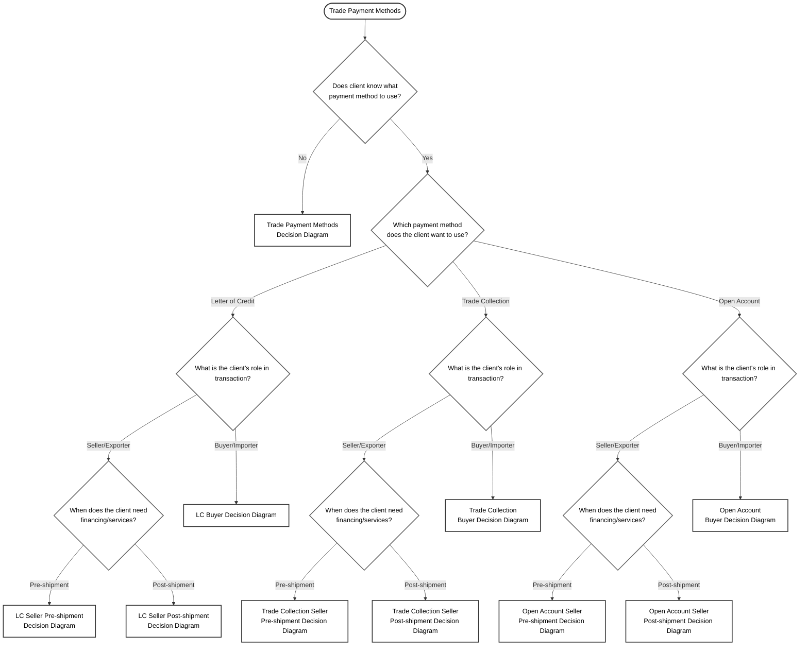

# Trade Payment Methods - Initial Decision Tree

## Overview

This is the initial decision flow for determining which trade payment method and related services a client needs. It starts with identifying if the client knows their preferred payment method and then routes them to the appropriate specialized decision diagrams.

## Decision Flow

## Decision Logic

### Primary Flow:

1. **Initial Assessment**: Determine if client has already identified their preferred payment method
2. **Method Selection**: For clients who know their preference, identify the specific payment method
3. **Role Identification**: Establish whether client is a seller/exporter or buyer/importer
4. **Timing Classification**: For sellers, determine if services are needed pre-shipment or post-shipment

### Key Decision Points:

- **Knowledge Assessment**: Whether client understands payment method options
- **Payment Method**: Letter of Credit, Trade Collection, or Open Account
- **Transaction Role**: Seller/Exporter vs Buyer/Importer perspective
- **Service Timing**: Pre-shipment vs Post-shipment service needs (for sellers)

### Routing Logic:

- **Unknown Payment Method**: Routes to comprehensive payment method decision diagram
- **Letter of Credit Buyer**: Routes to full LC buyer decision flow with all financing and service options
- **Seller Services**: Split by timing (pre/post shipment) for more targeted product recommendations
- **Trade Collection & Open Account**: Routes to specialized decision diagrams for each payment method

This initial tree ensures clients are directed to the most relevant detailed decision diagrams based on their role, payment method preference, and timing needs.
