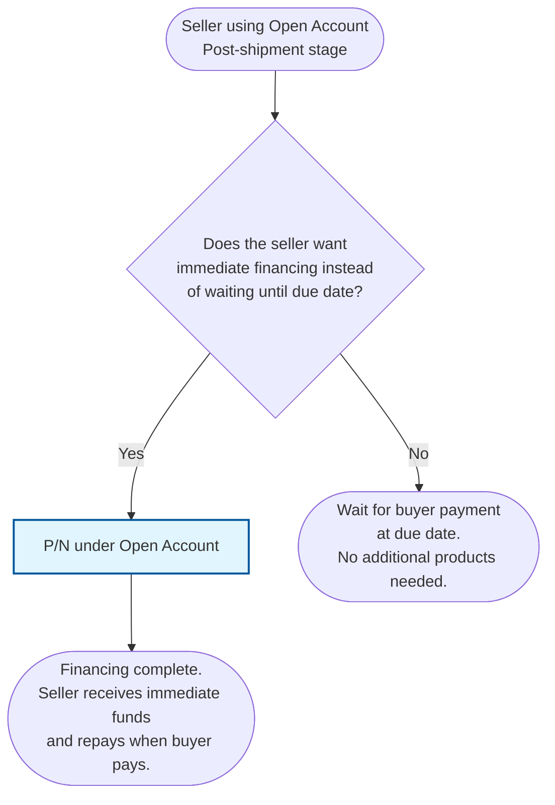

# Seller Post-Shipment Open Account Decision Diagram

## Decision Points Summary

### 1. Immediate Financing Need

**Question:** Does the seller want immediate financing instead of waiting until due date?

**Decision Criteria:**

- **Yes**: Use P/N under Open Account (Seller) when the seller doesn't want to wait until due date and needs immediate financing
- **No**: Wait for buyer payment at the agreed due date without additional products

## Product Details

### P/N under Open Account (Seller)

- **Type**: Post-shipment financing for sellers
- **Usage**: When the seller doesn't want to wait until due date, they can go to their bank for immediate financing using P/N under Open Account (Seller)
- **Outcome**: Seller receives immediate funds and the transaction flow is complete
