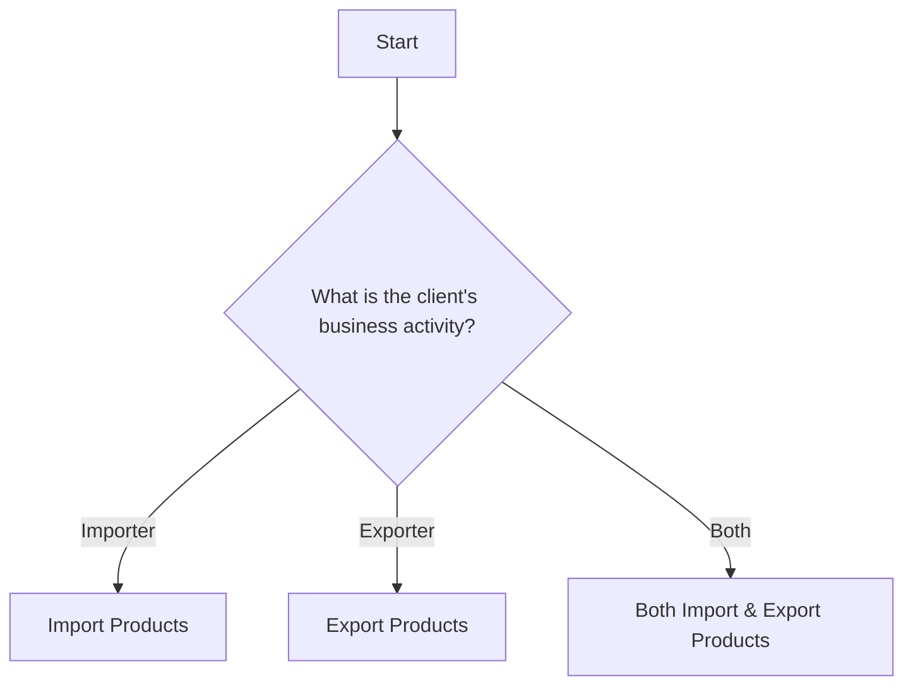

# Parser Module Documentation

## What This Module Does

The **parser** module handles reading and managing decision tree files written in Mermaid format. It converts text-based flowcharts into structured decision trees that the chatbot can navigate.

## Files

### mermaid_parser.py
**Purpose**: Converts Mermaid flowchart text into structured decision tree objects

**What it does**:
- Reads `.md` files containing Mermaid flowchart syntax
- Parses the flowchart text to identify nodes, questions, choices, and connections
- Creates `DecisionNode` objects that the chatbot can use
- Handles different node types (start, decision, outcome, product)

**Example Input** (Mermaid format):


**Example Output** (Structured objects):
```python
[
    DecisionNode(
        node_id="B",
        question="What is the client's business activity?", 
        choices=["Importer", "Exporter", "Both"],
        node_type=NodeType.DECISION
    ),
    DecisionNode(
        node_id="C", 
        question="Import Products",
        node_type=NodeType.OUTCOME
    ),
    # ... more nodes
]
```

### tree_manager.py  
**Purpose**: Manages multiple decision trees and provides a unified interface

**What it contains**:
- **MultiDecisionTreeManager** - main class that loads and manages multiple trees
- **Tree Loading** - reads all `.md` files from a directory
- **Cross-Tree Navigation** - allows jumping between different decision trees  
- **Node Lookup** - finds nodes across all loaded trees
- **Start Node Detection** - identifies entry points for each tree

**Key Features**:

1. **Loads Multiple Trees**:
   ```python
   manager = MultiDecisionTreeManager()
   manager.load_trees_from_directory("src/decision_trees/")
   # Loads: global_markets_decision_dag.md, product_recommendation_decision_dag.md, etc.
   ```

2. **Tree Selection**:
   ```python
   # Find best starting tree based on client's pre-answered questions
   best_tree = manager.choose_best_starting_tree(pre_answered_questions)
   ```

3. **Node Access**:
   ```python
   # Get a specific node from any tree
   node = manager.get_node("hedge_decision_importer", tree_name="global-markets")
   
   # Get all decision nodes across all trees
   all_nodes = manager.get_all_decision_nodes()
   ```

## How It Works Together

### 1. **Loading Phase** (Application Startup)
```
src/decision_trees/*.md files
         ↓
    mermaid_parser.py reads each file
         ↓  
    Converts Mermaid text → DecisionNode objects
         ↓
    multi_tree_manager.py stores all trees:
    {
        "global-markets": {node_dict},
        "product-recommendation": {node_dict}
    }
```

### 2. **Client Session** (Runtime)
```
Client provides information
         ↓
Extractor pre-answers some questions  
         ↓
MultiDecisionTreeManager picks best starting tree
         ↓
Chatbot navigates through the selected tree
         ↓
Can switch to different tree if needed
```

## Example Decision Tree File

**File**: `src/decision_trees/global_markets_decision_dag.md`
```mermaid
flowchart TD
    ClientType{What is the client's business activity?}
    ClientType -->|Importer| ImporterPath[Importer Path]
    ClientType -->|Exporter| ExporterPath[Exporter Path] 
    ClientType -->|Both Importer & Exporter| BothPath[Both Paths]
    
    ImporterPath --> HedgeImporter{Do you want to hedge FX risk for imports?}
    HedgeImporter -->|Yes| HedgeProportionImporter{What proportion of imports should be hedged?}
    HedgeImporter -->|No| NoHedgeImporter[No hedging products needed]
    
    # ... more flowchart continues
```

## How Client Uses It

1. **Development Time**: 
   - Business analysts create/modify decision trees in Mermaid format
   - Save as `.md` files in `src/decision_trees/` folder

2. **Application Startup**:
   - `MultiDecisionTreeManager` automatically loads all tree files
   - Validates and structures them for navigation

3. **Client Session**:
   - System picks appropriate starting tree based on client profile
   - Navigates through nodes asking questions
   - Can switch trees if client needs different products
   - Reaches final recommendations

4. **Easy Updates**:
   - Just edit the `.md` file to change decision logic
   - Restart application to load new version
   - No code changes needed for new decision paths

This makes the decision trees easy to maintain and update by non-technical users while providing powerful multi-tree navigation capabilities.
