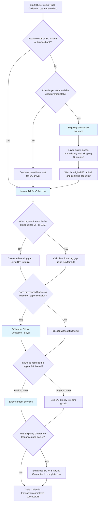

# Trade Collection Products - Buyer Decision Diagram (Pre/Post Shipment)

```mermaid
graph TD
    A[Start: Buyer using Trade Collection payment method] --> B{Has the original B/L arrived at buyer's bank?}

    B -->|No| C{Does buyer want to claim goods immediately?}
    B -->|Yes| D[Inward Bill for Collection]

    C -->|Yes| E[Shipping Guarantee Issuance]
    C -->|No| F[Continue base flow - wait for B/L arrival]

    F --> D

    D --> G{What payment terms is the buyer using: D/P or D/A?}

    G -->|D/P| H[Calculate financing gap using D/P formula]
    G -->|D/A| I[Calculate financing gap using D/A formula]

    H --> J{Does buyer need financing based on gap calculation?}
    I --> J

    J -->|Yes| K[P/N under Bill for Collection - Buyer]
    J -->|No| L[Proceed without financing]

    K --> M{In whose name is the original B/L issued?}
    L --> M

    M -->|Buyer's name| N[Use B/L directly to claim goods]
    M -->|Bank's name| O[Endorsement Services]

    O --> P{Was Shipping Guarantee Issuance used earlier?}
    N --> P

    P -->|Yes| Q[Exchange B/L for Shipping Guarantee to complete flow]
    P -->|No| R[Trade Collection transaction completed successfully]

    E --> S[Buyer claims goods immediately with Shipping Guarantee]
    S --> T[Wait for original B/L arrival and continue base flow]
    T --> D

    Q --> R

    style D fill:#e1f5fe
    style K fill:#e1f5fe
    style E fill:#e1f5fe
    style O fill:#e1f5fe
```
