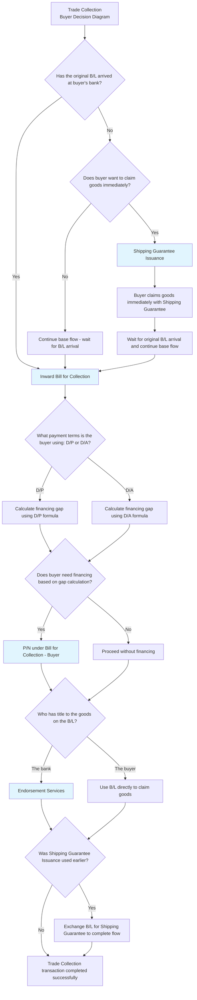

# Trade Collection - Buyer Pre-shipment Decision Diagram

## Decision Points Summary

1. **B/L Arrival Status**: Determines if buyer can proceed with standard collection or needs shipping guarantee
2. **Immediate Goods Claim**: When B/L hasn't arrived, decides if urgent goods access is needed
3. **Payment Terms**: D/P (Documents against Payment) vs D/A (Documents against Acceptance) affects financing calculations
4. **Financing Need**: Based on calculated financing gap using appropriate formula
5. **B/L Ownership**: Determines if endorsement services are required
6. **Shipping Guarantee Usage**: Affects final completion steps

## Flow Conclusion

The Trade Collection buyer pre-shipment flow concludes when the buyer successfully receives the goods and completes payment obligations according to the agreed terms (D/P or D/A), with all necessary document exchanges completed.
