# Trade Collection - Buyer Pre-shipment Decision Diagram (With Extra Products)

```mermaid
flowchart TD
    A@{ label: "<span style=\"--tw-scale-x:\">Trade Collection</span><br style=\"--tw-scale-x:\"><span style=\"--tw-scale-x:\">Buyer Decision Diagram</span>" } --> B@{ label: "Has the original B/L arrived at buyer's bank?" }
    B -- No --> C{"Does buyer want to claim goods immediately?"}
    B -- Yes --> D["Inward Bill for Collection"]
    C -- Yes --> E["Shipping Guarantee Issuance"]
    C -- No --> F["Continue base flow - wait for B/L arrival"]
    F --> D
    D --> G{"What payment terms is the buyer using: D/P or D/A?"}
    G -- D/P --> H["Calculate financing gap using D/P formula"]
    G -- D/A --> I["Calculate financing gap using D/A formula"]
    H --> J{"Does buyer need financing based on gap calculation?"}
    I --> BA_Check{"Does seller need stronger payment security OR concerned about waiting 90 days?"}
    BA_Check -- Yes --> BA1["Bankers Acceptance"]
    BA_Check -- No --> J
    BA1 --> J
    J -- Yes --> K["P/N under Bill for Collection - Buyer"]
    J -- No --> L["Proceed without financing"]
    K --> M{"Who has title to the goods on the B/L?"}
    L --> M
    M -- The buyer --> N["Use B/L directly to claim goods"]
    M -- The bank --> O["Endorsement Services"]
    O --> P{"Was Shipping Guarantee Issuance used earlier?"}
    N --> P
    P -- Yes --> Q["Exchange B/L for Shipping Guarantee to complete flow"]
    P -- No --> R["Trade Collection transaction completed successfully"]
    E --> S["Buyer claims goods immediately with Shipping Guarantee"]
    S --> T["Wait for original B/L arrival and continue base flow"]
    T --> D
    Q --> R

    A@{ shape: stadium}
    B@{ shape: diamond}
    F@{ shape: rect}
    L@{ shape: rect}
    N@{ shape: rect}
    Q@{ shape: rect}
    R@{ shape: rect}
    S@{ shape: rect}
    T@{ shape: rect}
     D:::productBox
     E:::productBox
     BA_Check:::newDecisionBox
     BA1:::newProductBox
     K:::productBox
     O:::productBox
    classDef productBox fill:#e1f5fe,stroke:#01579b,stroke-width:2px
    classDef newProductBox fill:#ffebee,stroke:#c62828,stroke-width:2px,color:#c62828
    classDef newDecisionBox fill:#fce4ec,stroke:#d81b60,stroke-width:2px,color:#d81b60
```

## Decision Points Summary

1. **B/L Arrival Status**: Determines if buyer can proceed with standard collection or needs shipping guarantee
2. **Immediate Goods Claim**: When B/L hasn't arrived, decides if urgent goods access is needed
3. **Payment Terms**: D/P (Documents against Payment) vs D/A (Documents against Acceptance) affects financing calculations
4. **Bankers Acceptance Check**: For D/A, assess if seller created time draft with buyer's bank acceptance and wants stronger payment security
5. **Financing Need**: Based on calculated financing gap using appropriate formula
6. **B/L Ownership**: Determines if endorsement services are required
7. **Shipping Guarantee Usage**: Affects final completion steps

## Flow Conclusion

The Trade Collection buyer pre-shipment flow concludes when the buyer successfully receives the goods and completes payment obligations according to the agreed terms (D/P or D/A), with all necessary document exchanges completed. With Bankers Acceptance, sellers get enhanced payment security through bank guarantee.

## New Products Added

### Bankers Acceptance (BA) - Trade Collection Context

- **Product Type**: A financing for Buyers (benefits both buyer and seller)
- **When Available**: Only for D/A Collection when seller created time draft and buyer's bank accepted it
- **How It Works**:
  - Buyer triggers the product but seller drives the decision based on their needs
  - Seller gets bank guarantee (safer than buyer's promise)
  - Seller can choose to discount BA for immediate cash or wait for guaranteed maturity payment
- **Seller Benefits**:
  - Stronger payment security than just buyer's promise
  - Guaranteed payment certainty after documents are accepted
  - Flexibility to discount for immediate cash (don't wait 90 days)
  - Bank-guaranteed maturity payment if seller prefers to wait
- **Use When Seller**:
  - Wants stronger payment security than standard D/A Collection
  - Is considering whether to take immediate cash or wait for maturity
  - Is concerned about waiting 90 days for payment from buyer
- **Decision Point**: Check if seller created time draft, buyer's bank accepted it, and seller wants stronger payment security

This enhancement provides Trade Collection buyers with the ability to offer Bankers Acceptance to sellers, improving the seller's payment security and giving them more flexibility in cash flow management.
