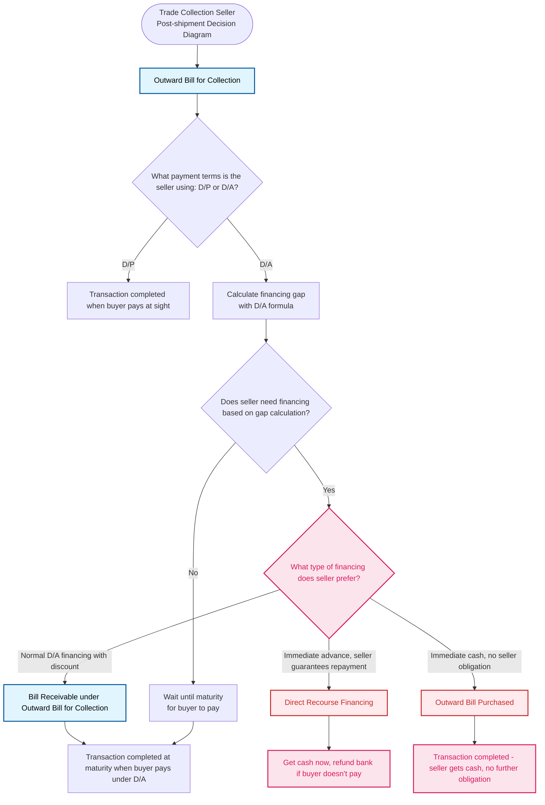

# Trade Collection - Seller Post-shipment Decision Diagram (With Extra Products)

## Decision Points Summary

1. **Start**: Seller has shipped goods and is using Trade Collection payment method (mandatory Outward Bill for Collection)
2. **Payment Terms**: Determine if using D/A (Documents against Acceptance) or D/P (Documents against Payment)
3. **Financing Need**: For D/A, calculate financing gap and determine if financing is needed
4. **Financing Options**: If financing needed, choose between standard, recourse, or non-recourse financing options

## Product Flow Conclusions

- **D/P Path**: Transaction completed when buyer pays at sight
- **D/A + No Financing**: Wait until maturity for buyer to pay
- **D/A + Bill Receivable**: Standard financing with recourse, completed at maturity
- **D/A + DRF**: Get advance cash with recourse - seller must refund if buyer doesn't pay
- **D/A + OBP**: Seller gets immediate cash with no further obligation

## New Products Added

### Direct Recourse Financing (DRF)

- **Product Type**: A post-shipment financing for sellers with recourse
- **How It Works**:
  - Bank gives seller money in advance
  - If buyer doesn't pay, seller must refund the bank
- **Use When**:
  - Seller needs advance funds and trusts buyer will pay at maturity
  - Seller wants immediate cash but accepts the risk
- **Risk**: Seller bears ultimate responsibility if buyer defaults

### Outward Bill Purchased (OBP)

- **Product Type**: A post-shipment financing for sellers without recourse
- **How It Works**:
  - Seller gets immediate cash with no further obligation
  - Bank handles all buyer payment risk
- **Use When**:
  - Seller wants immediate cash instead of waiting 30-60 days
  - Seller wants bank to handle buyer payment risk completely
- **Benefits**: No further obligation for seller after transaction

Both new products appear once in the diagram and offer distinct financing options with different risk profiles:

- **DRF**: For sellers who trust the buyer will pay and need advance cash with recourse
- **OBP**: For sellers who want immediate cash with no further obligations or risk
