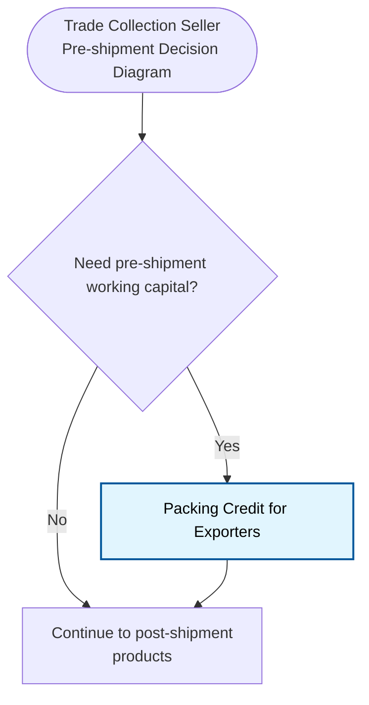

# Trade Collection - Seller Pre-shipment Decision Diagram

```mermaid
flowchart TD
    Start@{ label: "<span style=\"color:\">Trade Collection Seller</span><br style=\"--tw-scale-x:\"><span style=\"color:\">Pre-shipment Decision Diagram</span>" } --> NeedCapital{"Need pre-shipment working capital?"}
    NeedCapital -- Yes --> PackingCredit["Packing Credit for Exporters"]
    NeedCapital -- No --> ContinueFlow["Continue to post-shipment<br/>products"]
    PackingCredit --> ContinueFlow

    Start@{ shape: stadium}
    ContinueFlow@{ shape: rect}
     PackingCredit:::productBox
    classDef productBox fill:#e1f5fe,stroke:#01579b,stroke-width:2px,color:#000
```
