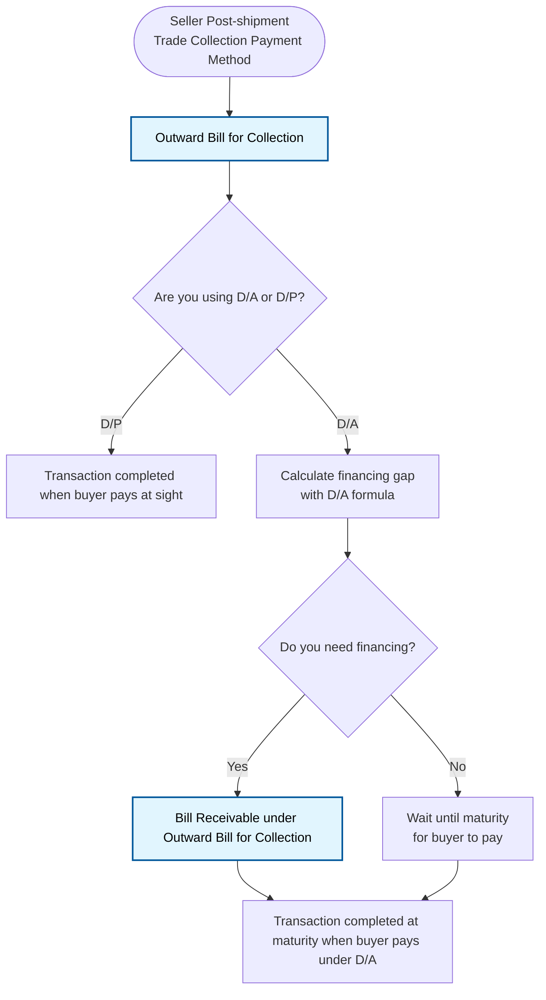

# Trade Collection - Seller Post-shipment Decision Diagram

```mermaid
flowchart TD
    Start@{ label: "Seller Post-shipment<br/>Trade Collection Payment Method" } --> OutwardBill["Outward Bill for Collection"]

    OutwardBill --> PaymentTerms{"Are you using D/A or D/P?"}

    PaymentTerms -- D/P --> EndDP["Transaction completed when buyer pays at sight"]
    PaymentTerms -- D/A --> CalcGap@{ label: "Calculate financing gap<br/>with D/A formula" }

    CalcGap --> NeedFinancing{"Do you need financing?"}

    NeedFinancing -- Yes --> BillReceivable["Bill Receivable under Outward Bill for Collection"]
    NeedFinancing -- No --> WaitMaturity@{ label: "Wait until maturity<br/>for buyer to pay" }

    BillReceivable --> EndDA["Transaction completed at maturity when buyer pays under D/A"]
    WaitMaturity --> EndDA

    Start@{ shape: stadium}
    CalcGap@{ shape: rect}
    WaitMaturity@{ shape: rect}
    OutwardBill:::productBox
    BillReceivable:::productBox

    classDef productBox fill:#e1f5fe,stroke:#01579b,stroke-width:2px,color:#000
```
