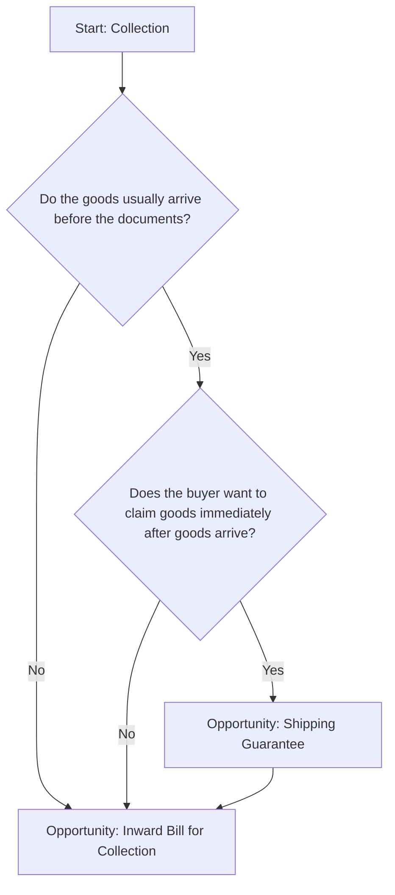

## Prompt

Create a Mermaid decision tree for Trade Finance Collections by asking the following questions?

- Do the goods usually arrive before the documents?
  If not, then Opportunity: Inward Bill for Collection.
- Does the buyer want to claim goods immediately after goods arrive?
  If not, then Opportunity: Inward Bill for Collection.
  If the answer is yes to both, then Opportunity: Shipping Guarantee

## Decision Tree

