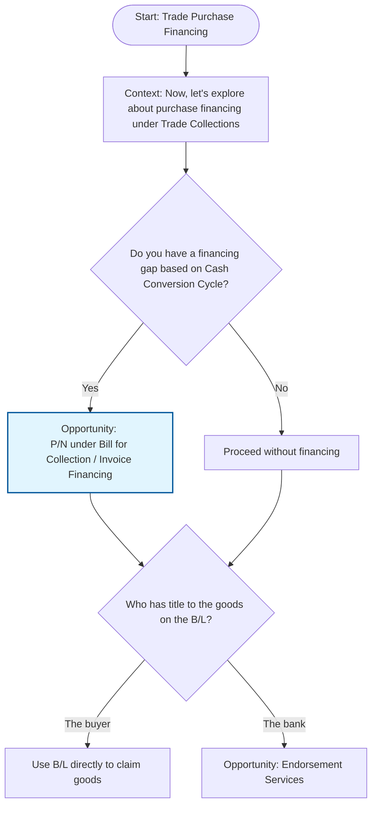

## Prompt

Create a Mermaid decision tree for Trade Finance Collections by
starting with "Start: Trade Purchase Financing"
then ask the following questions:

- Do you have a financing gap based on Cash Conversion Cycle?
  If no, "Proceed without financing"
  If yes, then "Opportunity: P/N under Bill for Collection / Invoice Financing".
- Who has title to the goods?
  If it's the bank, then "Endorsement Services".
  If it's the buyer, "Use B/L directly to claim goods".
- Was Shipping Guarantee Issuance used earlier?
  If yes, "Exchange B/L for Shipping Guarantee to complete flow" then "Trade Collection transaction completed successfully".
  If no, "Trade Collection transaction completed successfully".

## Decision Tree

