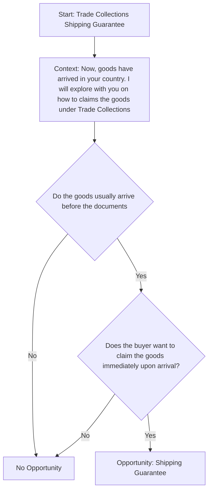

## Prompt

Create a Mermaid decision tree for Trade Finance Collections Shipping Guarantee by asking the following questions?

- Do the goods usually arrive before the documents?
- Does the buyer want to claim goods immediately after goods arrive?

## Decision Tree

