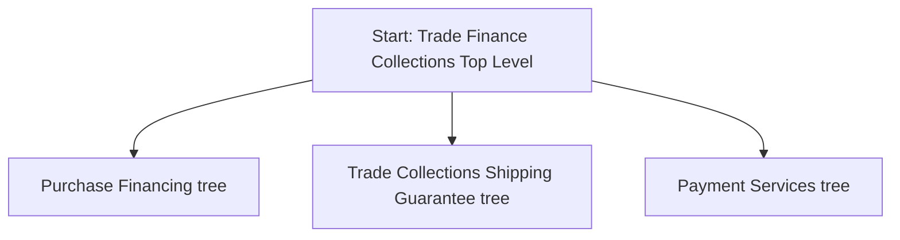

## Prompt

Create a Mermaid decision tree for Trade Finance Collections by asking
Start with "Start: Trade Finance Collectios Top Level"
Then next level has 3 nodes in parallel
Purchase Financing tree
Trade Collections Shipping Guarantee tree
Payment Services tree

## Decision Tree

