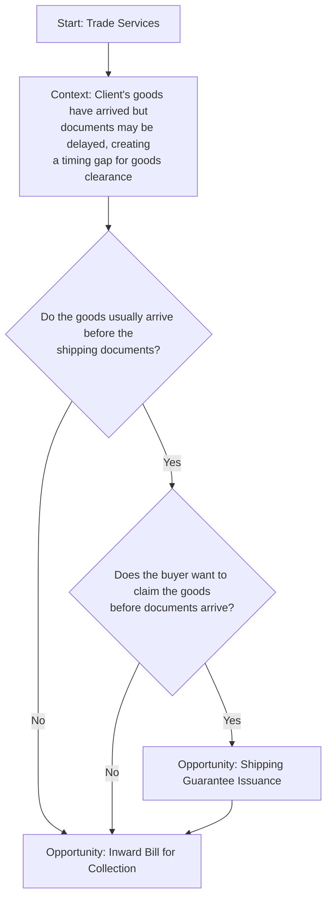

## Prompt

Create a Mermaid decision tree for Trade Finance Collections Shipping Guarantee by asking the following questions?

- Do the goods usually arrive before the shipping documents?
- Does the buyer want to claim the goods before documents arrive?

## Decision Tree

