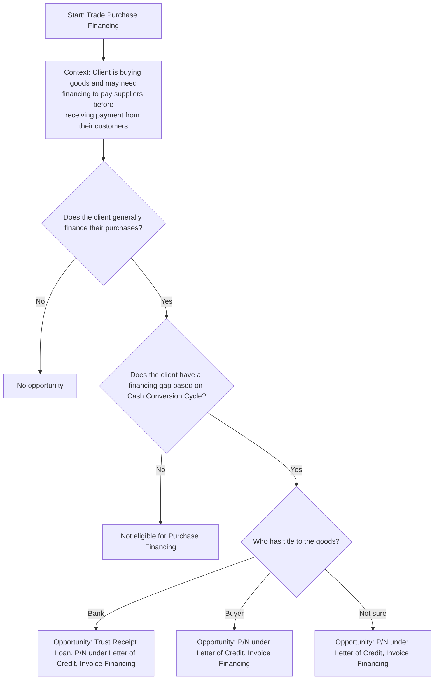

## Prompt

Create a Mermaid decision tree for Trade Finance Purchase by asking the following questions

- Does the client generally finance their purchases?
  If no, then "No opportunity"
- Does the client have a financing gap based on Cash Conversion Cycle?
  If no, then "Not eligible for Purchase Financing"
- Who has the title to the goods on the B/L?
  If the answer if Bank, then Opportunity: Trust Receipt Loan, P/N under Letter of Credit, Invoice Financing
  If the answer is the buyer, then Opportunity: P/N under Letter of Credit, Invoice Financing
  If the answer is not sure, then Opportunity: P/N under Letter of Credit, Invoice Financing

## Decision Tree

