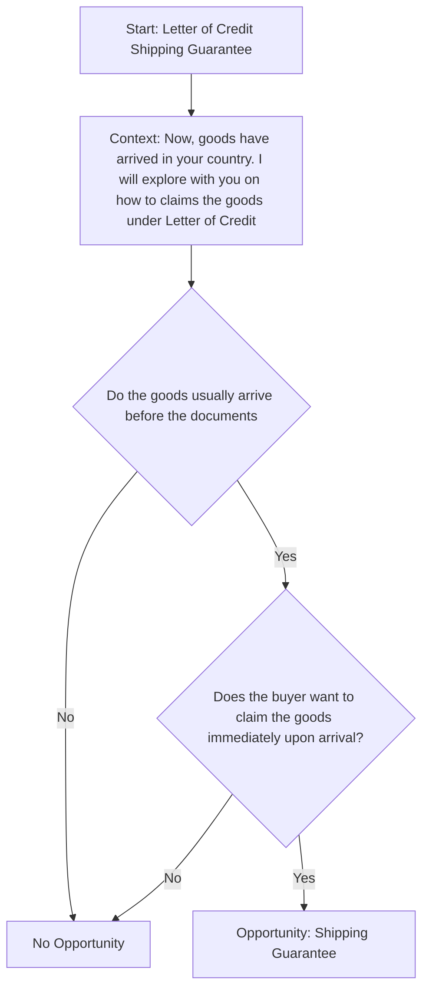

## Prompt

Create a Mermaid decision tree for Trade Finance Letter of Credit Shipping Guarantee by asking the following questions:

- Do the goods usually arrive before the documents?
  if No, "No Opportunity"
  if Yes, ask:
  - Does the buyer want to claim goods immediately after goods arrive?
    if Yes, "Opportunity: Shipping Guarantee"
    if No, "No Opportunity"

## Decision Tree

