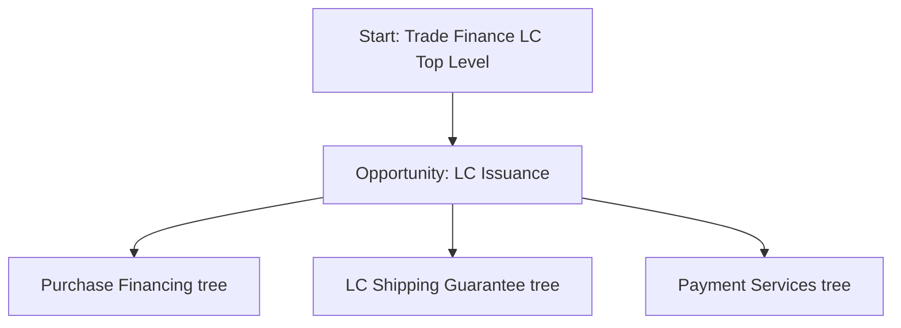

## Prompt

Create a Mermaid decision tree for Trade Finance Letter of Credit
Start with "Start: Trade Finance LC Top Level"
The next level is "Opportunity: LC Issuance"
Then next level has 3 nodes in parallel:
Purchase Financing tree
LC Shipping Guarantee tree
Payment Services tree

## Decision Tree

