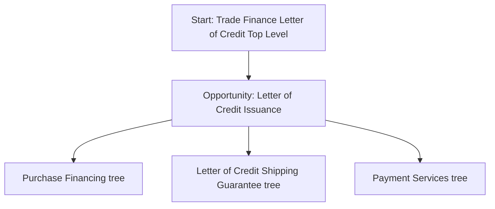

## Prompt

Create a Mermaid decision tree for Trade Finance Letter of Credit
Start with "Start: Trade Finance Letter of Credit Top Level"
The next level is "Opportunity: Letter of Credit Issuance"
Then next level has 3 nodes in parallel:
Purchase Financing tree
Letter of Credit Shipping Guarantee tree
Payment Services tree

## Decision Tree

