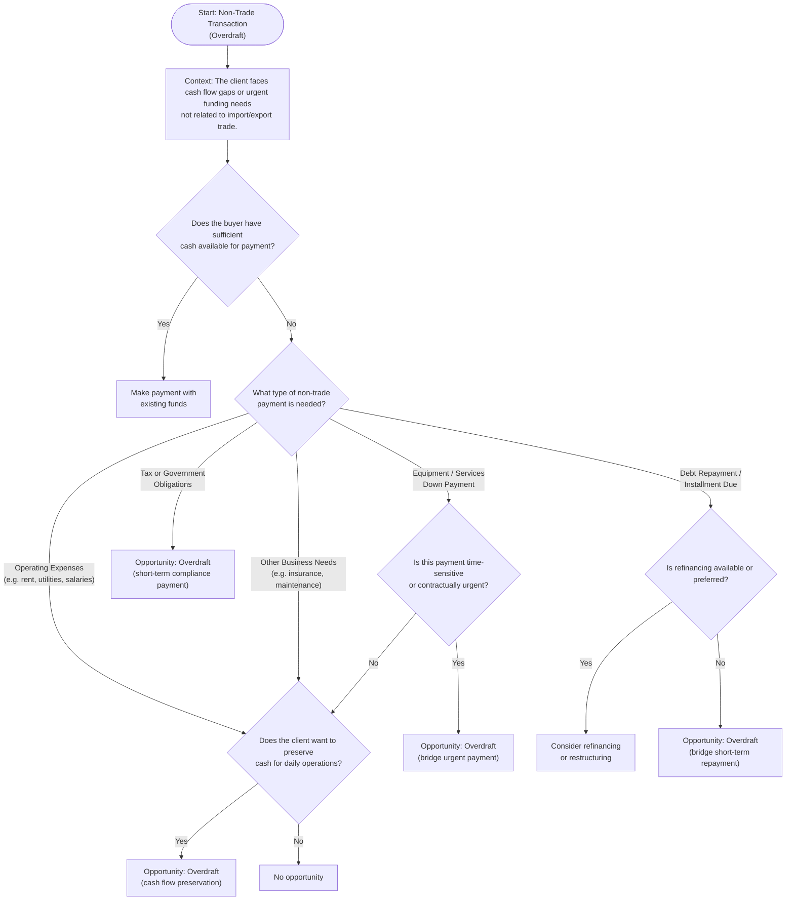

## Prompt

Create a Mermaid decision tree diagram for Non-Trade Transactions (Overdraft).
Follow these steps:

1. Start: "Non-Trade Transaction (Overdraft)".  
   → Ask: "Does the buyer have sufficient cash for payment?"

   - If Yes → "Make payment with existing funds".
   - If No → continue.

2. If No cash: Ask "What type of non-trade payment is needed?"

   - If Equipment/Services down payment → Ask: "Is this an urgent payment?"
     - If Yes → "Overdraft".
     - If No → Continue to the next question.
   - If Other business payments → continue to next question.

3. Next question: "Does the buyer want to preserve cash flow?"
   - If Yes → "Overdraft".
   - If No → "No opportunity".

## Decision tree

