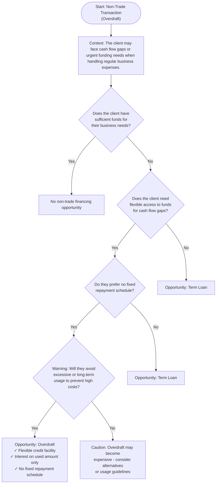

## Prompt

Create a Mermaid decision tree diagram for Non-Trade Transactions (Overdraft).
Follow these steps:

1. Start: "Non-Trade Transaction (Overdraft)" with context about cash flow gaps and urgent funding needs.

2. Ask: "Does the client have sufficient funds for their business needs?"

   - If Yes → "No non-trade financing opportunity"
   - If No → continue

3. Ask: "Does the client need flexible access to funds for cash flow gaps?"

   - If Yes → continue
   - If No → "Opportunity: Term Loan"

4. Ask: "Do they prefer no fixed repayment schedule?"

   - If Yes → Warning about usage
   - If No → "Opportunity: Term Loan"

5. Warning: "Will they avoid excessive or long-term usage to prevent high costs?"
   - If Yes → "Opportunity: Overdraft"
   - If No → "Caution: Overdraft may become expensive"

## Decision tree

