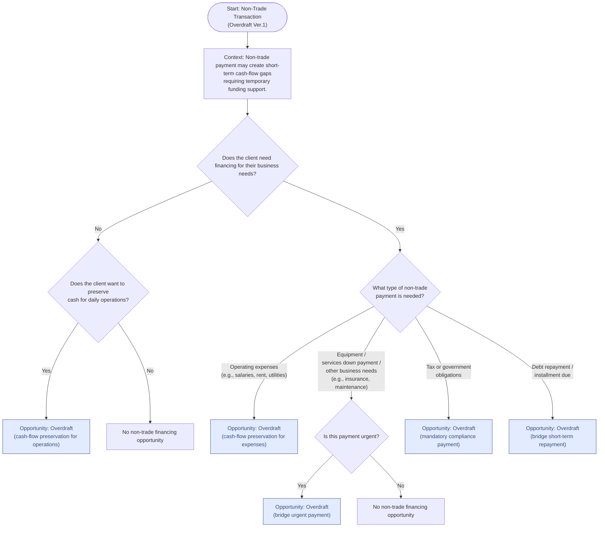

# Overdraft Decision Tree

# Prompt

Create a non-product decision tree as mermaid code inside this file. Only see OD - Overdraft key points in this 'loan_non_trade_tree.md' file

## Decision Flow

## Decision Logic

This decision tree is based on the key characteristics of Overdraft facilities:

### Key Questions Based on Overdraft Features:

1. **Cash Flow Fluctuations**: Does the client experience day-to-day cash flow variations?
2. **Flexibility Needs**: Do they need maximum flexibility in accessing and repaying funds?
3. **Unexpected Expenses**: Are there unforeseen costs that need immediate coverage?
4. **Interest Preference**: Do they want to pay interest only on amounts actually used?
5. **Repayment Flexibility**: Can they repay when funds are available rather than on fixed schedules?
6. **Usage Discipline**: Will they use the facility responsibly to avoid high long-term costs?

### Overdraft Suitability Indicators:

✓ **Ideal for clients who need:**

- Automatic short-term loans through current account
- Interest only on overdrawn amounts
- Flexible drawdown and repayment timing
- Management of cash flow fluctuations
- Coverage for unexpected expenses

⚠️ **Caution for clients who might:**

- Use excessively or for long periods
- Accumulate expensive interest and fees
- Need structured repayment schedules

---

## Product Details

### OD - Overdraft

Definition:
A flexible, short-term credit facility that allows customers to withdraw more than the available balance in their current account, up to a pre-approved limit.

Key Points:

- Acts as an automatic short-term loan through the current account.
- Interest applies only on the overdrawn amount, not the entire limit.
- Funds can be drawn and repaid anytime within the approved limit.
- No fixed repayment schedule — repay when funds are available.
- Ideal for managing day-to-day cash flow fluctuations and unexpected expenses.
- If used excessively or for long periods, interest and fees can become expensive.

✓ Flexible credit facility
✓ Interest on used amount only
✓ No fixed repayment schedule
