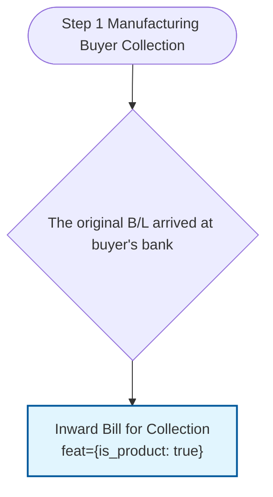

# Trade Collection - Buyer Decision Tree (Inward Bill for Collection)

```mermaid
flowchart TD
    Start(["Step 1 Manufacturing Buyer Collection"]) --> Q1@{ label: "The original B/L arrived at buyer's bank<br/>" }
    Q1 --> P1["Inward Bill for Collection<br/>feat={is_product: true}"]

    Q1@{ shape: diamond}
    P1:::productBox
    classDef productBox fill:#e1f5fe,stroke:#01579b,stroke-width:2px
```
