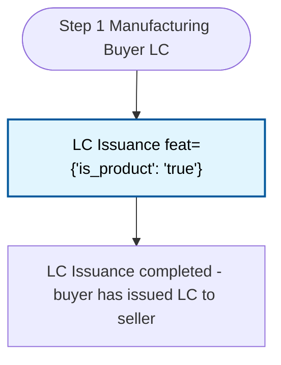

# LC Buyer Decision Tree - LC Issuance

```mermaid
flowchart TD
    Start(["Step 1 Manufacturing Buyer LC"]) --> P1["LC Issuance feat={'is_product': 'true'}"]
    P1 --> End1["LC Issuance completed - buyer has issued LC to seller"]

    P1:::productBox
    classDef productBox fill:#e1f5fe,stroke:#01579b,stroke-width:2px,color:#000
```
