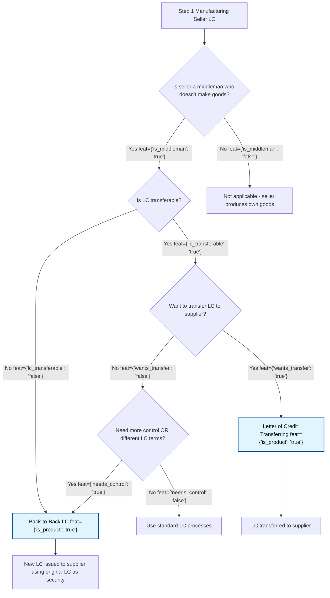

# LC Transfer vs Back-to-Back LC Decision Tree

```mermaid
flowchart TD
    Start["Step 1 Manufacturing Seller LC"] --> CheckMiddleman{"Is seller a middleman who doesn't make goods?"}
    CheckMiddleman -->|"Yes feat={'is_middleman': 'true'}"| TransferableCheck{"Is LC transferable?"}
    CheckMiddleman -->|"No feat={'is_middleman': 'false'}"| End1["Not applicable - seller produces own goods"]
    TransferableCheck -->|"Yes feat={'lc_transferable': 'true'}"| WantTransfer{"Want to transfer LC to supplier?"}
    TransferableCheck -->|"No feat={'lc_transferable': 'false'}"| BackToBackLC["Back-to-Back LC feat={'is_product': 'true'}"]
    WantTransfer -->|"Yes feat={'wants_transfer': 'true'}"| LCTransfer["Letter of Credit Transferring feat={'is_product': 'true'}"]
    WantTransfer -->|"No feat={'wants_transfer': 'false'}"| BackToBackCheck{"Need more control OR different LC terms?"}
    BackToBackCheck -->|"Yes feat={'needs_control': 'true'}"| BackToBackLC
    BackToBackCheck -->|"No feat={'needs_control': 'false'}"| End2["Use standard LC processes"]
    LCTransfer --> End3["LC transferred to supplier"]
    BackToBackLC --> End4["New LC issued to supplier using original LC as security"]

    BackToBackLC:::productBox
    LCTransfer:::productBox
    classDef productBox fill:#e1f5fe,stroke:#01579b,stroke-width:2px,color:#000
```
