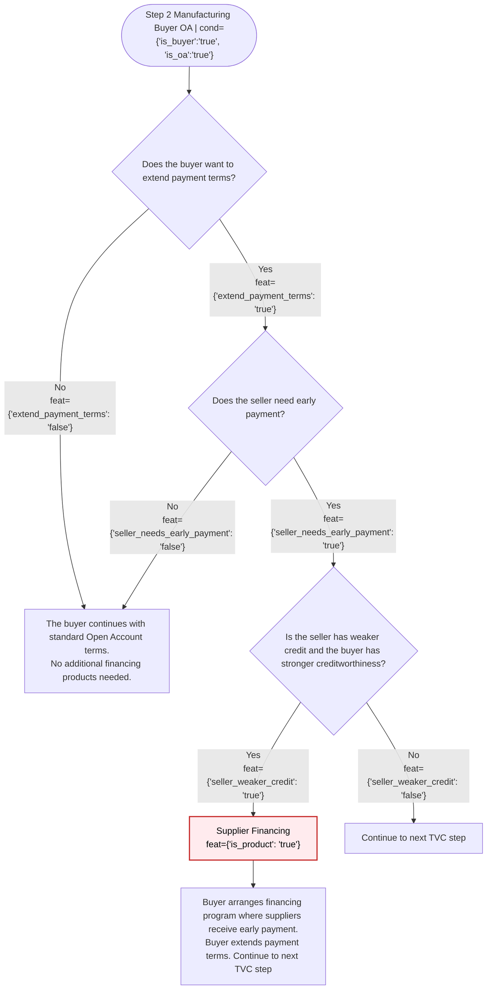

# Buyer Open Account Decision Diagram - Supplier Financing

## Decision Flow for Buyers Using Open Account Payment Method

```mermaid
flowchart TD
    Start(["Step 2 Manufacturing Buyer OA | cond={'is_buyer':'true', 'is_oa':'true'}"]) --> Q1{"Does the buyer want to extend payment terms?"}
    Q1 -- "Yes<br>feat={'extend_payment_terms': 'true'}" --> Q2{"Does the seller need early payment?"}
    Q1 -- "No<br>feat={'extend_payment_terms': 'false'}" --> End1["The buyer continues with standard Open Account terms.<br>No additional financing products needed."]
    Q2 -- "Yes<br>feat={'seller_needs_early_payment': 'true'}" --> Q3{"Is the seller has weaker credit and the buyer has stronger creditworthiness?"}
    Q2 -- "No<br>feat={'seller_needs_early_payment': 'false'}" --> End1
    Q3 -- "Yes<br>feat={'seller_weaker_credit': 'true'}" --> P1["Supplier Financing<br>feat={'is_product': 'true'}"]
    Q3 -- "No<br>feat={'seller_weaker_credit': 'false'}" --> End2["Continue to next TVC step"]
    P1 --> End3["Buyer arranges financing program where suppliers receive early payment.<br>Buyer extends payment terms. Continue to next TVC step"]

     P1:::productBox
    classDef productBox fill:#ffebee,stroke:#c62828,stroke-width:2px,color:#000
```
