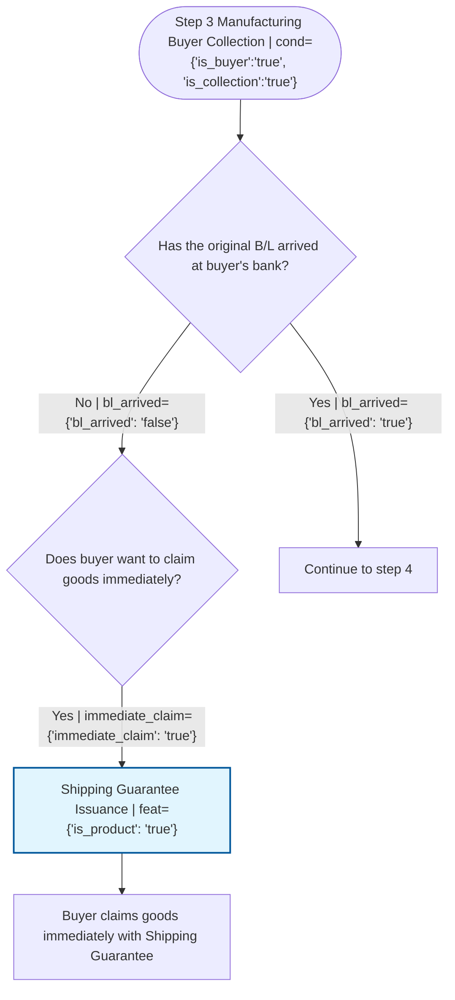

# Trade Collection - Buyer Shipping Guarantee Decision Path

```mermaid
flowchart TD
    Start(["Step 3 Manufacturing Buyer Collection | cond={'is_buyer':'true', 'is_collection':'true'}"]) --> Q1@{ label: "Has the original B/L arrived at buyer's bank?" }
    Q1 -- "No | bl_arrived={'bl_arrived': 'false'}" --> Q2{"Does buyer want to claim goods immediately?"}
    Q1 -- "Yes | bl_arrived={'bl_arrived': 'true'}" --> End1["Continue to step 4"]
    Q2 -- "Yes | immediate_claim={'immediate_claim': 'true'}" --> P1["Shipping Guarantee Issuance | feat={'is_product': 'true'}"]
    P1 --> End2["Buyer claims goods immediately with Shipping Guarantee"]

    Q1@{ shape: diamond}
    End1@{ shape: rect}
    End2@{ shape: rect}
     P1:::productBox
    classDef productBox fill:#e1f5fe,stroke:#01579b,stroke-width:2px
```
