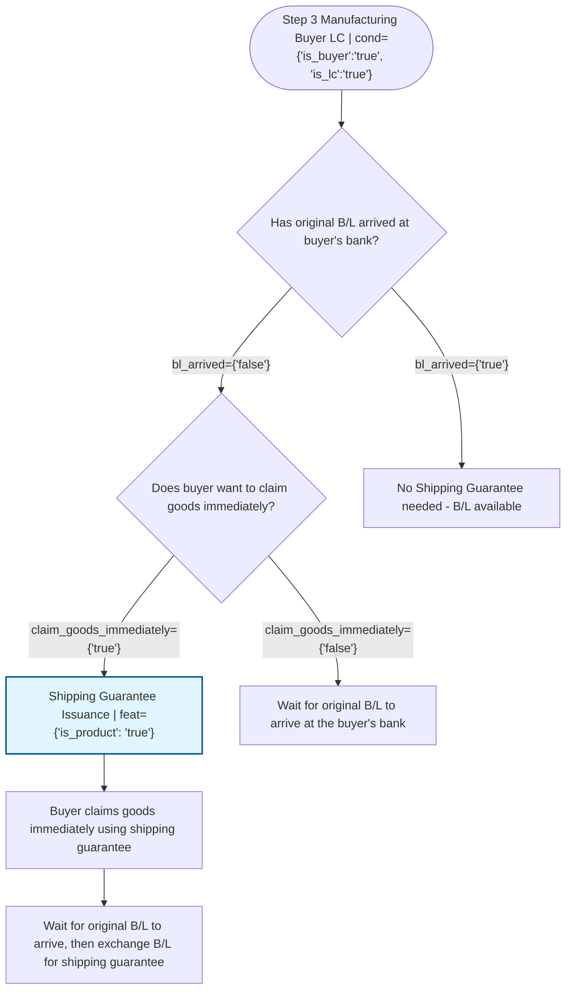

# LC Products Decision Diagram - Buyer (Shipping Guarantee Only)

```mermaid
flowchart TD
    Start(["Step 3 Manufacturing Buyer LC | cond={'is_buyer':'true', 'is_lc':'true'}"]) --> Q1@{ label: "Has original B/L arrived at buyer's bank?" }
    Q1 -- "bl_arrived={'false'}" --> Q2{"Does buyer want to claim goods immediately?"}
    Q1 -- "bl_arrived={'true'}" --> End1["No Shipping Guarantee needed - B/L available"]
    Q2 -- "claim_goods_immediately={'true'}" --> P1["Shipping Guarantee Issuance | feat={'is_product': 'true'}"]
    Q2 -- "claim_goods_immediately={'false'}" --> End2["Wait for original B/L to arrive at the buyer's bank"]
    P1 --> End3["Buyer claims goods immediately using shipping guarantee"]
    End3 --> End4["Wait for original B/L to arrive, then exchange B/L for shipping guarantee"]

    Q1@{ shape: diamond}
     P1:::productBox
    classDef productBox fill:#e1f5fe,stroke:#01579b,stroke-width:2px
```
