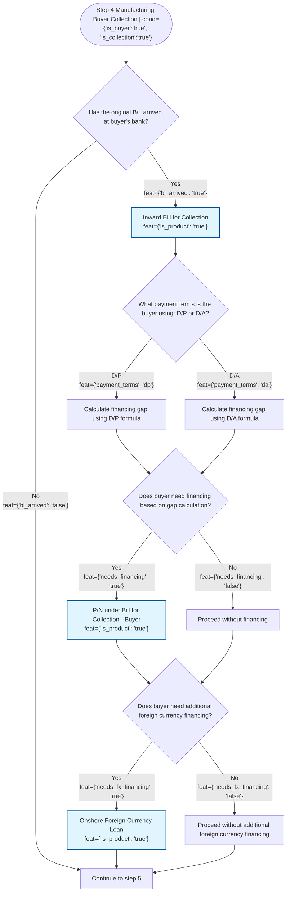

# Trade Collection - Buyer Decision Diagram (Simplified)

```mermaid
flowchart TD
    Start(["Step 4 Manufacturing Buyer Collection | cond={'is_buyer':'true', 'is_collection':'true'}"]) --> Q1@{ label: "Has the original B/L arrived at buyer's bank?" }
    Q1 -- "Yes<br/>feat={'bl_arrived': 'true'}" --> P1["Inward Bill for Collection<br/>feat={'is_product': 'true'}"]
    Q1 -- "No<br/>feat={'bl_arrived': 'false'}" --> End1["Continue to step 5"]
    P1 --> Q2{"What payment terms is the buyer using: D/P or D/A?"}
    Q2 -- "D/P<br/>feat={'payment_terms': 'dp'}" --> End2["Calculate financing gap using D/P formula"]
    Q2 -- "D/A<br/>feat={'payment_terms': 'da'}" --> End3["Calculate financing gap using D/A formula"]
    End2 --> Q3{"Does buyer need financing based on gap calculation?"}
    End3 --> Q3
    Q3 -- "Yes<br/>feat={'needs_financing': 'true'}" --> P2["P/N under Bill for Collection - Buyer<br/>feat={'is_product': 'true'}"]
    Q3 -- "No<br/>feat={'needs_financing': 'false'}" --> End4["Proceed without financing"]
    P2 --> Q4{"Does buyer need additional foreign currency financing?"}
    End4 --> Q4
    Q4 -- "Yes<br/>feat={'needs_fx_financing': 'true'}" --> P3["Onshore Foreign Currency Loan<br/>feat={'is_product': 'true'}"]
    Q4 -- "No<br/>feat={'needs_fx_financing': 'false'}" --> End5["Proceed without additional foreign currency financing"]
    P3 --> End1
    End5 --> End1

    Q1@{ shape: diamond}
    Q2@{ shape: diamond}
    Q3@{ shape: diamond}
    Q4@{ shape: diamond}
    End1@{ shape: rect}
    End2@{ shape: rect}
    End3@{ shape: rect}
    End4@{ shape: rect}
    End5@{ shape: rect}
    P1:::productBox
    P2:::productBox
    P3:::productBox
    classDef productBox fill:#e1f5fe,stroke:#01579b,stroke-width:2px
```
