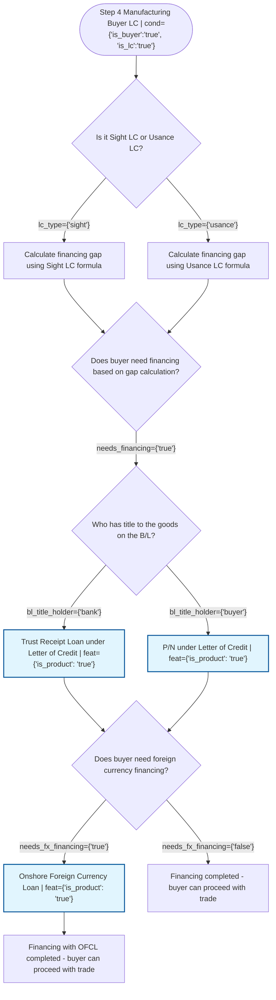

# LC Products Decision Diagram - Buyer (Trust Receipt, P/N & OFCL)

```mermaid
flowchart TD
    Start@{ label: "Step 4 Manufacturing Buyer LC | cond={'is_buyer':'true', 'is_lc':'true'}" } --> LC_Type{"Is it Sight LC or Usance LC?"}
    LC_Type -- "lc_type={'sight'}" --> Calc_Sight["Calculate financing gap using Sight LC formula"]
    LC_Type -- "lc_type={'usance'}" --> Calc_Usance["Calculate financing gap using Usance LC formula"]
    Calc_Sight --> Need_Finance{"Does buyer need financing based on gap calculation?"}
    Calc_Usance --> Need_Finance
    Need_Finance -- "needs_financing={'true'}" --> BL_Name{"Who has title to the goods on the B/L?"}
    BL_Name -- "bl_title_holder={'bank'}" --> TR1@{ label: "Trust Receipt Loan under Letter of Credit | feat={'is_product': 'true'}" }
    BL_Name -- "bl_title_holder={'buyer'}" --> PN1@{ label: "P/N under Letter of Credit | feat={'is_product': 'true'}" }
    TR1 --> OFCL_Check{"Does buyer need foreign currency financing?"}
    PN1 --> OFCL_Check
    OFCL_Check -- "needs_fx_financing={'true'}" --> OFCL1@{ label: "Onshore Foreign Currency Loan | feat={'is_product': 'true'}" }
    OFCL_Check -- "needs_fx_financing={'false'}" --> No_OFCL_Complete["Financing completed - buyer can proceed with trade"]
    OFCL1 --> OFCL_Complete["Financing with OFCL completed - buyer can proceed with trade"]

    Start@{ shape: stadium}
     TR1:::productBox
     PN1:::productBox
     OFCL1:::productBox
    classDef productBox fill:#e1f5fe,stroke:#01579b,stroke-width:2px
```
