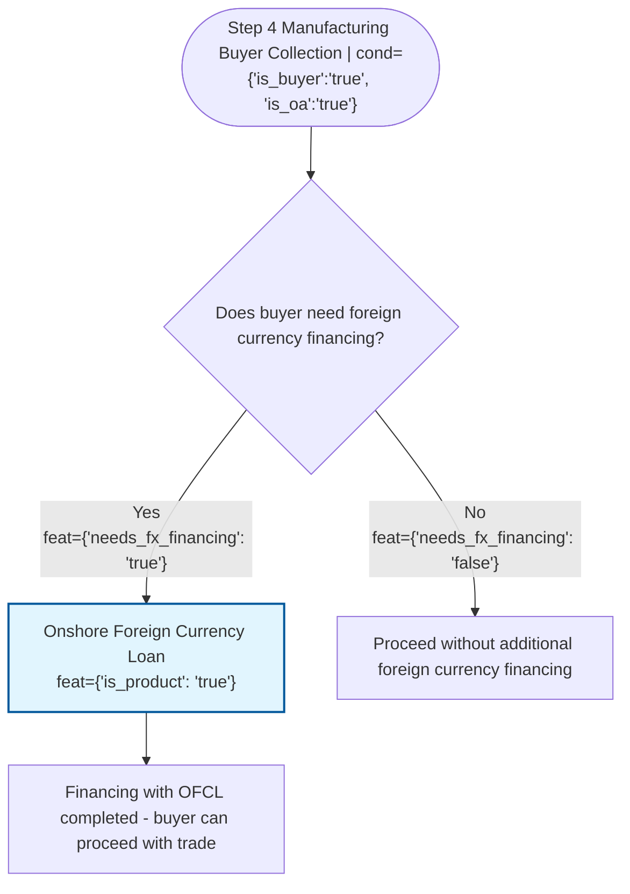

# Buyer Open Account Decision Diagram - OFCL Focus

## Decision Flow for Buyers Using Open Account Payment Method

```mermaid
flowchart TD
    Start@{ label: "Step 4 Manufacturing Buyer Collection | cond={'is_buyer':'true', 'is_oa':'true'}" } --> Q1{"Does buyer need foreign currency financing?"}
    Q1 -- "Yes<br>feat={'needs_fx_financing': 'true'}" --> Product1@{ label: "Onshore Foreign Currency Loan<br>feat={'is_product': 'true'}" }
    Q1 -- "No<br>feat={'needs_fx_financing': 'false'}" --> End1["Proceed without additional foreign currency financing"]
    Product1 --> End2["Financing with OFCL completed - buyer can proceed with trade"]

    Start@{ shape: stadium}
    Product1@{ shape: rect}
     Product1:::productBox
    classDef productBox fill:#e1f5fe,stroke:#01579b,stroke-width:2px
```
