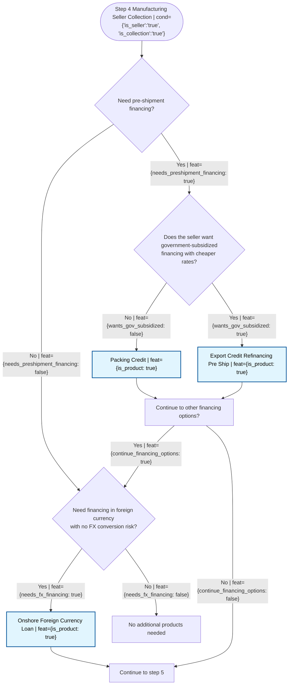

# Trade Collection - Seller Decision Diagram (Manufacturing Scenario 4)

```mermaid
flowchart TD
    Start["Step 4 Manufacturing Seller Collection | cond={'is_seller':'true', 'is_collection':'true'}"] --> PreShipment{"Need pre-shipment financing?"}
    PreShipment -->|"Yes | feat={needs_preshipment_financing: true}"| GovSubsidy{"Does the seller want government-subsidized<br>financing with cheaper rates?"}
    PreShipment -->|"No | feat={needs_preshipment_financing: false}"| FXRisk{"Need financing in foreign currency<br>with no FX conversion risk?"}
    GovSubsidy -->|"Yes | feat={wants_gov_subsidized: true}"| ECR["Export Credit Refinancing Pre Ship | feat={is_product: true}"]
    GovSubsidy -->|"No | feat={wants_gov_subsidized: false}"| PackingCredit["Packing Credit | feat={is_product: true}"]
    FXRisk -->|"Yes | feat={needs_fx_financing: true}"| OFCL["Onshore Foreign Currency Loan | feat={is_product: true}"]
    FXRisk -->|"No | feat={needs_fx_financing: false}"| EndNoProducts["No additional products needed"]
    PackingCredit --> PostShipmentCheck["Continue to other financing options?"]
    ECR --> PostShipmentCheck
    OFCL --> EndTransaction["Continue to step 5"]
    PostShipmentCheck -->|"Yes | feat={continue_financing_options: true}"| FXRisk
    PostShipmentCheck -->|"No | feat={continue_financing_options: false}"| EndTransaction

    Start@{ shape: stadium}
    EndNoProducts@{ shape: rect}
    PostShipmentCheck@{ shape: rect}
    EndTransaction@{ shape: rect}
     ECR:::productBox
     PackingCredit:::productBox
     OFCL:::productBox
    classDef productBox fill:#e1f5fe,stroke:#01579b,stroke-width:2px,color:#000
```
