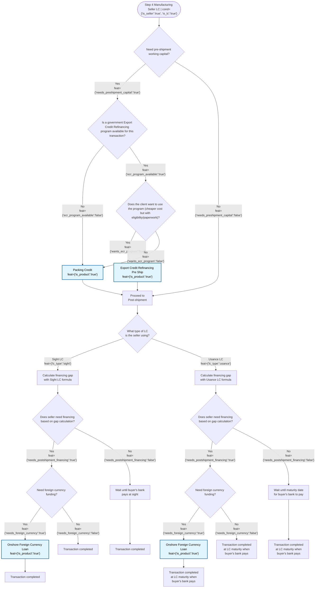

# Letter of Credit Products - Seller Decision Tree (Manufacturing)

```mermaid
flowchart TD
    Start(["Step 4 Manufacturing Seller LC | cond={'is_seller':'true', 'is_lc':'true'}"]) --> Q1{"Need pre-shipment working capital?"}
    Q1 -- "Yes<br>feat={'needs_preshipment_capital':'true'}" --> Q2{"Is a government Export Credit Refinancing program available for this transaction?"}
    Q1 -- "No<br>feat={'needs_preshipment_capital':'false'}" --> End1["Proceed to<br>Post-shipment"]
    Q2 -- "No<br>feat={'ecr_program_available':'false'}" --> P1["Packing Credit<br>feat={'is_product':'true'}"]
    Q2 -- "Yes<br>feat={'ecr_program_available':'true'}" --> Q3{"Does the client want to use the program (cheaper cost but with eligibility/paperwork)?"}
    Q3 -- "Yes<br>feat={'wants_ecr_program':'true'}" --> P2["Export Credit Refinancing Pre Ship<br>feat={'is_product':'true'}"]
    Q3 -- "No<br>feat={'wants_ecr_program':'false'}" --> P1
    P2 --> End1
    P1 --> End1
    End1 --> Q4{"What type of LC<br>is the seller using?"}
    Q4 -- "Sight LC<br>feat={'lc_type':'sight'}" --> End2["Calculate financing gap<br>with Sight LC formula"]
    Q4 -- "Usance LC<br>feat={'lc_type':'usance'}" --> End3["Calculate financing gap<br>with Usance LC formula"]
    End2 --> Q5{"Does seller need financing based on gap calculation?"}
    End3 --> Q6{"Does seller need financing based on gap calculation?"}
    Q5 -- "Yes<br>feat={'needs_postshipment_financing':'true'}" --> Q7{"Need foreign currency funding?"}
    Q5 -- "No<br>feat={'needs_postshipment_financing':'false'}" --> End4["Wait until buyer's bank<br>pays at sight"]
    Q6 -- "Yes<br>feat={'needs_postshipment_financing':'true'}" --> Q8{"Need foreign currency funding?"}
    Q6 -- "No<br>feat={'needs_postshipment_financing':'false'}" --> End5["Wait until maturity date<br>for buyer's bank to pay"]
    Q7 -- "Yes<br>feat={'needs_foreign_currency':'true'}" --> P3["Onshore Foreign Currency Loan<br>feat={'is_product':'true'}"]
    Q7 -- "No<br>feat={'needs_foreign_currency':'false'}" --> End6["Transaction completed"]
    Q8 -- "Yes<br>feat={'needs_foreign_currency':'true'}" --> P4["Onshore Foreign Currency Loan<br>feat={'is_product':'true'}"]
    Q8 -- "No<br>feat={'needs_foreign_currency':'false'}" --> End7["Transaction completed<br>at LC maturity when<br>buyer's bank pays"]
    P3 --> End8["Transaction completed"]
    P4 --> End9["Transaction completed<br>at LC maturity when<br>buyer's bank pays"]
    End4 --> End10["Transaction completed"]
    End5 --> End11["Transaction completed<br>at LC maturity when<br>buyer's bank pays"]

     P1:::productBox
     P2:::productBox
     P3:::productBox
     P4:::productBox
    classDef productBox fill:#e1f5fe,stroke:#01579b,stroke-width:2px,color:#000
```
