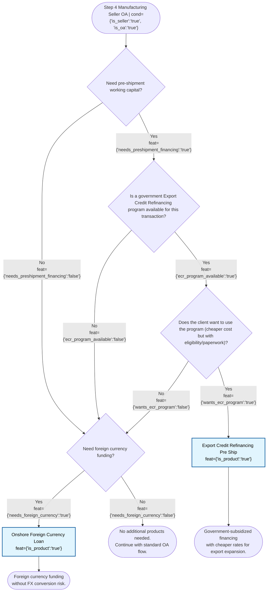

# Seller Open Account Decision Diagram - Filtered Products

```mermaid
flowchart TD
    Start(["Step 4 Manufacturing Seller OA | cond={'is_seller':'true', 'is_oa':'true'}"]) --> Q1{"Need pre-shipment working capital?"}
    Q1 -- "Yes<br>feat={'needs_preshipment_financing':'true'}" --> Q2{"Is a government Export Credit Refinancing program available for this transaction?"}
    Q1 -- "No<br>feat={'needs_preshipment_financing':'false'}" --> Q3{"Need foreign currency funding?"}
    Q2 -- "Yes<br>feat={'ecr_program_available':'true'}" --> Q4{"Does the client want to use the program (cheaper cost but with eligibility/paperwork)?"}
    Q2 -- "No<br>feat={'ecr_program_available':'false'}" --> Q3
    Q4 -- "Yes<br>feat={'wants_ecr_program':'true'}" --> P1["Export Credit Refinancing Pre Ship<br>feat={'is_product':'true'}"]
    Q4 -- "No<br>feat={'wants_ecr_program':'false'}" --> Q3
    Q3 -- "Yes<br>feat={'needs_foreign_currency':'true'}" --> P2["Onshore Foreign Currency Loan<br>feat={'is_product':'true'}"]
    Q3 -- "No<br>feat={'needs_foreign_currency':'false'}" --> End1(["No additional products needed.<br>Continue with standard OA flow."])
    P1 --> End2(["Government-subsidized financing<br>with cheaper rates for export expansion."])
    P2 --> End3(["Foreign currency funding<br>without FX conversion risk."])

     P1:::productBox
     P2:::productBox
    classDef productBox fill:#e1f5fe,stroke:#01579b,stroke-width:2px,color:#000
```
